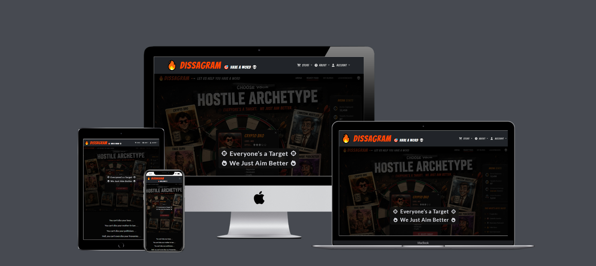
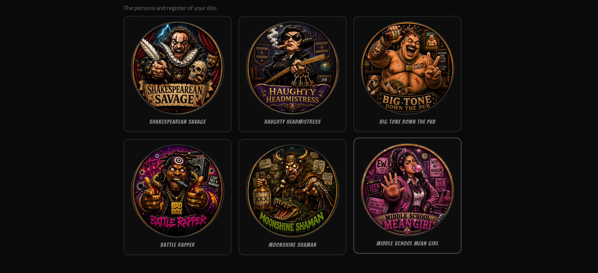
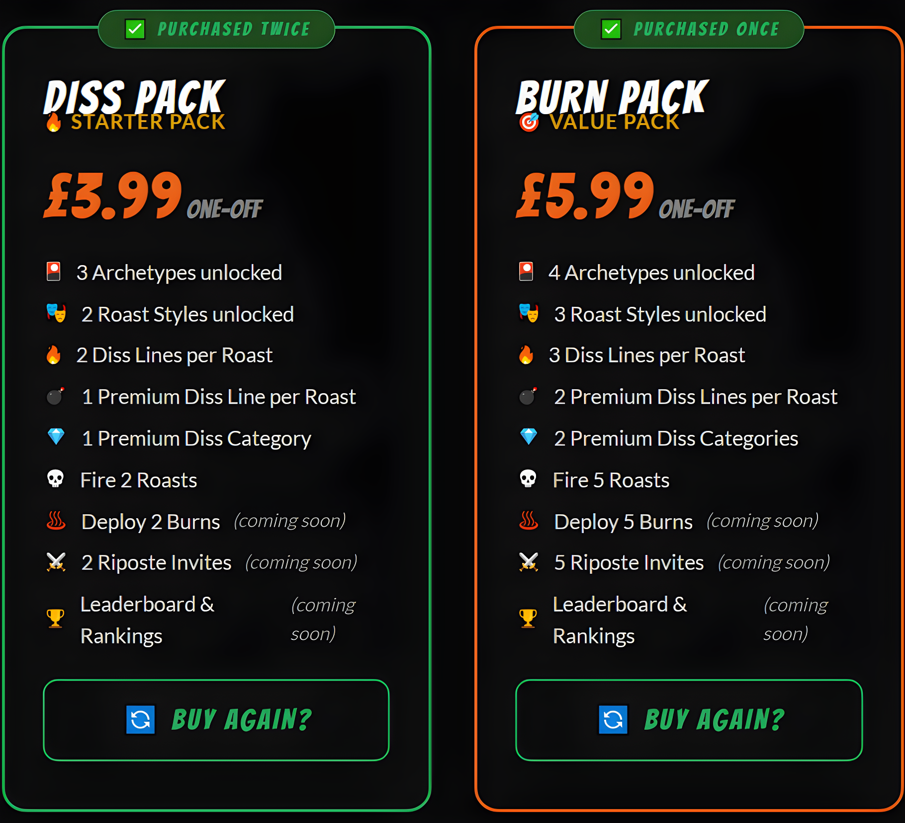
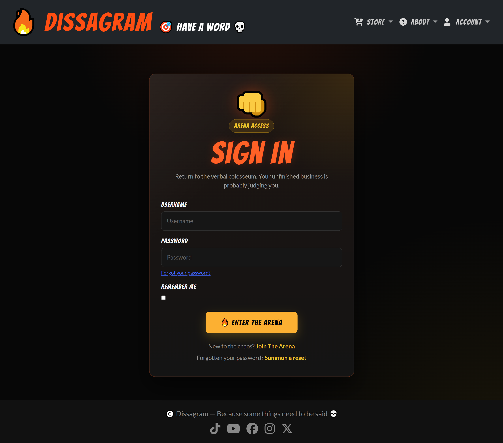
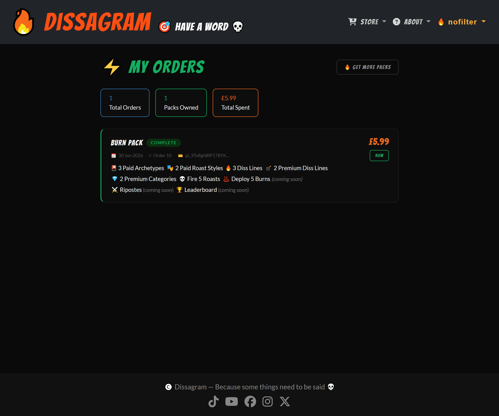
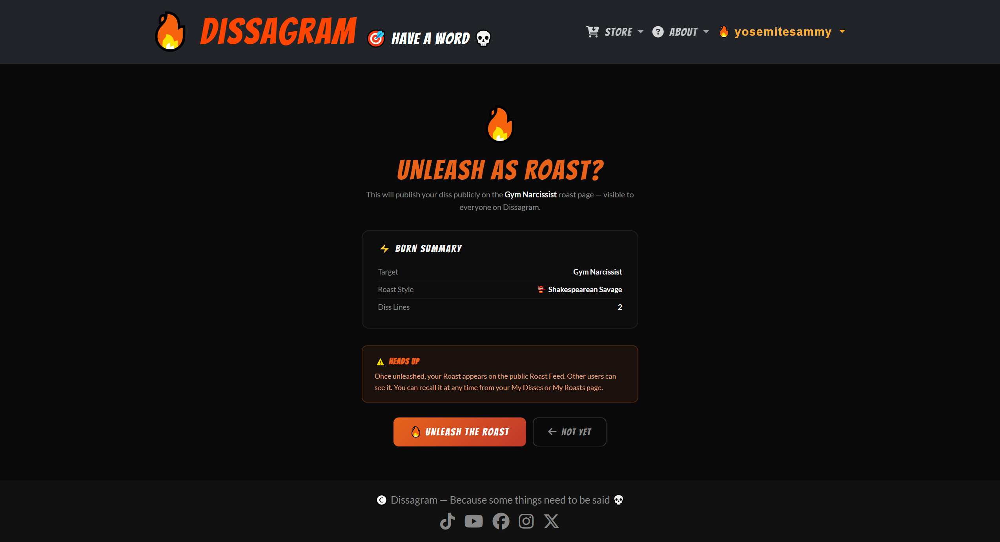
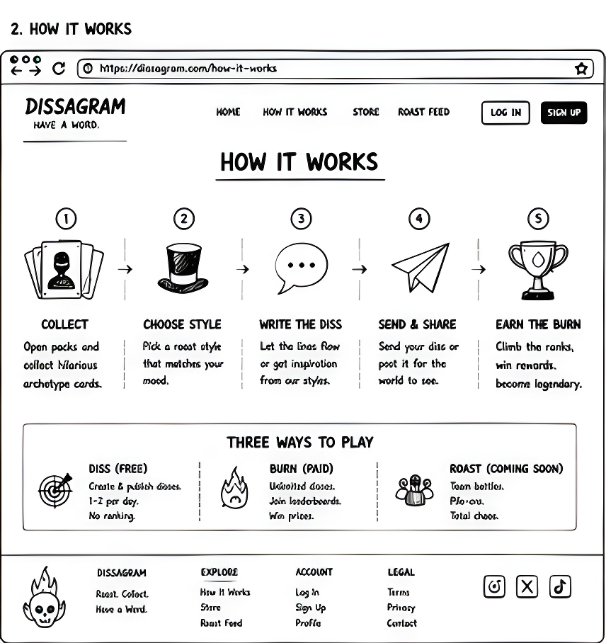
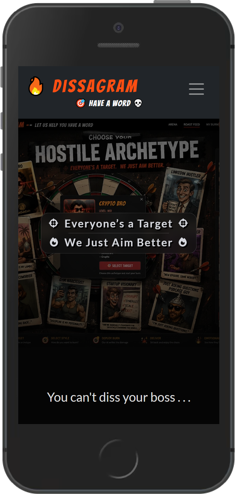
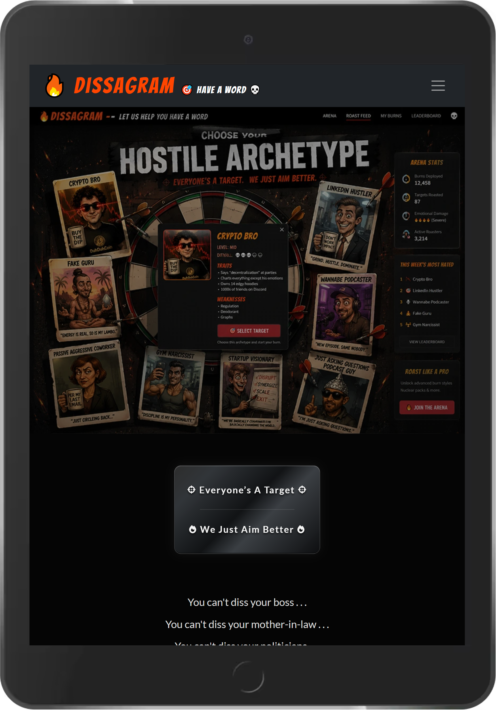
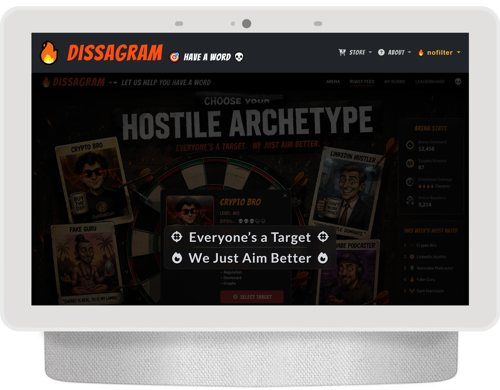

<h1 align="center" bold>🔥 Dissagram</h1>

<h3 align="center"></h3>

<br>

Dissagram is a satirical “Diss card” game where users assemble premium, professionally crafted insults against a rotating cast of instantly recognisable archetypes — from Fake Guru and Gym Narcissist to the Player, Pick-Me Bunny and Super Karen.

Users choose an archetype card, select the voice their Diss will be delivered in, pick their favourite roast lines, and add Premium Diss Categories to round off the burn.

Once complete, each Diss can be saved privately as a collectible trading card or published publicly as a Roast for the community to enjoy. Future features will allow users to deploy Roasts directly to people who suspiciously resemble the archetypes in question.

Part trading-card game, part roast battle, and part cathartic release valve, Dissagram turns everyday irritation into polished, shareable comedy.

Get started right here: ([Dissagram](https://dissagram-75687e7c9019.herokuapp.com/))

<br>
<br>

# Table of Contents

## Contents

- [Table of Contents](#table-of-contents)
- [Purpose & Value](#purpose--value)
- [User Stories](#user-stories)
  - [Visitor Goals](#visitor-goals)
- [Design](#design)
  + [Colour Scheme](#colour-scheme)
  + [Typography](#typography)
  + [Imagery](#imagery)
  + [Icons](#icons)
- [Structure](#structure)
- [Features](#features)
    + [Current Features](#current-features)
    + [Future Features](#future-features)
- [Wireframes](#wireframes)
- [Database Schema](#database-schema)
  + [Schema Rationale](#schema-rationale)
  + [ERD](#erd)
  + [Core Architectural Decisions](#core-architectural-decisions)
- [Security Overview](#security-overview)
- [Technologies](#technologies)
  + [Languages](#languages)
  + [Frameworks, Libraries & Programs](#frameworks-libraries--programs)
- [Testing](#testing)
  + [Automated Tests](#automated-tests)
  + [Manual Testing](#manual-testing)
  + [Testing User Stories](#testing-user-stories)
  + [Code Validation](#code-validation)
  + [Lighthouse](#lighthouse)
  + [Responsiveness](#responsiveness)
  + [Debugging](#debugging)
- [Deployment](#deployment)
  + [Heroku](#heroku)
  + [Forking the GitHub Repository](#forking-the-github-repository)
  + [Cloning the GitHub Repository](#cloning-the-github-repository)
- [Credits](#credits)
  + [Code](#code)
  + [Media](#media)
  + [Content](#content)
  + [Acknowledgements](#acknowledgements)

<br>
<br>

# Purpose & Value

Dissagram exists for a very specific, very human reason: sometimes the Fake Guru charging £400 for a silence retreat, the Gym Narcissist filming curls in a public walkway, or the LinkedIn thought-leader turning redundancy into a "growth chapter" deserves a beautifully crafted verbal warning.

Rather than leaving users to improvise insults in the emotional fog of mild-to-severe irritation, Dissagram gives them a curated roast arsenal: professionally written diss lines, illustrated archetype cards, distinctive delivery voices and premium comedy extras — all assembled into a shareable Diss in under two minutes.

The value proposition is threefold:

- **For the user** — a funny, satisfying, low-stakes creative outlet, with a freemium structure that lets them try the experience before unlocking the full roster of archetypes, roast styles and premium categories.
- **For the community** — a public Roast Feed where individual Disses become a shared, crowd-sourced pile-on against instantly recognisable archetypes.
- **For the business model** — one-off pack purchases keep the barrier to entry low, while gifting encourages organic growth and gives the product a built-in social loop.

<br>
<br>

# User Stories

## Visitor Goals

"**As a user of Dissagram, I would like** _______________"

:white_check_mark: *successfully implemented*

:x: *not yet implemented*

- :white_check_mark: *an interface layout that can be immediately understood, without the need for complicated instructions or a key*.
- :white_check_mark: *an easy navigation system whereby I can see exactly where I want to get at the click of a nav link*.
- :white_check_mark: *a homepage that clearly explains what the site does and invites me to get started*.
- :white_check_mark: *a "How It Works" page that walks me through the process before I commit to registering*.
- :white_check_mark: *to register for an account and log in securely*.
- :white_check_mark: *to build a diss by picking a target archetype, a roast style and a set of pre-written burn lines*.
- :white_check_mark: *a visual, trading-card-style way of browsing archetypes, rather than a plain dropdown list*.
- :white_check_mark: *archetypes split logically (e.g. by gender) so I can find the one I want quickly*.
- :white_check_mark: *to see which archetypes, roast styles and diss categories are locked, and a clear path to unlock them*.
- :white_check_mark: *a free tier so I can try the product before paying anything*.
- :white_check_mark: *to purchase a pack to unlock more content, with a clear breakdown of what I'm getting*.
- :white_check_mark: *to pay securely using a trusted, well-known payment provider*.
- :white_check_mark: *to be told clearly whether my payment succeeded or failed, with a helpful message either way*.
- :white_check_mark: *an order confirmation email after a successful purchase*.
- :white_check_mark: *to view a history of everything I've ordered*.
- :white_check_mark: *to cancel a pending order, and reinstate it if I change my mind*.
- :white_check_mark: *to gift a pack to another registered user*.
- :white_check_mark: *to save a diss as a private draft before deciding whether to share it*.
- :white_check_mark: *to edit a diss after creating it*.
- :white_check_mark: *to delete a diss I no longer want*.
- :white_check_mark: *to publish my diss publicly as a "Roast" for others to see*.
- :white_check_mark: *to recall a deployed Roast back to draft if I change my mind*.
- :white_check_mark: *to browse a public feed of all deployed Roasts, filterable by archetype and roast style*.
- :white_check_mark: *to view a dedicated public page for each archetype, showing every Roast deployed against them*.
- :white_check_mark: *clear, animated, non-intrusive notifications when I take an action (success, error, info)*.
- :white_check_mark: *to view and edit my own arena profile*.
- :white_check_mark: *to get in touch with the Dissagram team via a contact form, with a reason for my enquiry*.
- :white_check_mark: *to use the site on any device — mobile, tablet or desktop*.

- :x: *to leave comments on public Roasts*.
- :x: *to rate Roasts out of 5 flames, feeding into a leaderboard*.
- :x: *to see a leaderboard of the most-roasted archetypes and highest-rated burns*.
- :x: *to subscribe to a monthly "Roast Pack" for unlimited access and exclusive monthly drops*.
- :x: *to gift a pack to someone by email, even if they don't yet have an account*.
- :x: *to deploy the Diss / Roast as a Burn to somebody in need of a takedown*.
- :x: *to reply to a Burn with a "Riposte" of my own, building a chain*.
- :x: *to access a Battle Arena where users can go head-to-head*.
- :x: *to physically purchase a Dissagram board game*.

<br>
<br>

# Design

-   ## Colour Scheme

    -   Dissagram's palette is built around a near-black base with hot orange, ember-gold and crimson accents — a late-night roast-battle look: fiery, bold and just dangerous enough, while still staying clean and readable. Off-white body text keeps longer sections comfortable against the dark background.

    <h3 align="center"></h3>

    [Palette URL](https://coolors.co/2980b9-27ae60-111111-ffffff-ffac2b-ff4500)

-   ## Typography

    1) **Display / Brand Font**

         -   [Bangers](https://fonts.google.com/specimen/Bangers), a bold comic-style display font, is used for the logo, headings, buttons and badges — giving Dissagram its loud, collectible-card energy and making the interface feel playful from the first click.

        <h3 align="center"></h3>

    2) **Heading Accent Font**

         -   [DM Serif Display](https://fonts.google.com/specimen/DM+Serif+Display) is used sparingly for selected editorial headings, adding a touch of mock-serious grandeur that contrasts with the site's deliberately ridiculous subject matter.

        <h3 align="center"></h3>

    3) **Body Font**

         -   [Lato](https://fonts.google.com/specimen/Lato) handles body copy, form labels, descriptions and navigation — keeping diss lines, traits, weaknesses and custom notes sharp, readable and easy to scan on every device.

        <h3 align="center"></h3>

-   ## Imagery

    ### Homepage Hero

    The homepage opens with a bold, fire-themed hero image that immediately sets the tone: playful, confrontational and ready to roast. The visual leads users straight into the main call to action.

    <h3 align="center"></h3>

    ### Archetype Trading Cards

    Each Target Archetype (Fake Guru, Gym Narcissist, Pick-Me Bunny, etc.) is presented as full trading-card artwork, complete with a satirical caricature, background Easter eggs, traits, weaknesses and a catchphrase. These cards form the visual heart of the Build Your Diss carousel and the Diss Detail page.

    <h3 align="center"></h3>

    ### Roast Style Avatars

    Each Roast Style (Shakespearean Savage, Battle Rapper, Haughty Headmistress, etc.) has its own circular persona avatar, turning "tone of voice" into something visual, characterful and instantly recognisable throughout the builder and published Diss cards.

    <h3 align="center"></h3>

-   ## Icons

    ### Font Awesome Icons

    [Font Awesome](https://fontawesome.com/) icons are used throughout the navbar, page headers, action buttons and footer links, giving users quick visual cues without overcrowding the interface.

    <h3 align="center"></h3>

    ### Emoji as UI Language

    Emoji are used as a lightweight visual language across the site — 🔥 for burns, 🔒 for locked content, 🎁 for gifting, ✅/❌ for toast states — keeping the tone playful while making key states instantly understandable.

    <h3 align="center"></h3>

<br>
<br>

# Structure

-   Dissagram is structured as a Django full-stack web application, with each major user journey separated into clear, purpose-built sections:

<br>

| Page | Description |
|------|-------------|
| Home | Landing page introducing the concept with a hero image and call to action |
| How It Works | Static explainer page walking new users through the diss-building process |
| Sign In / Register | Authentication pages powered by django-allauth, restyled to match the Dissagram aesthetic |
| Get Your Pack | Pack store — Diss Pack, Roast Pack and a "Coming Soon" Roast Pack subscription teaser |
| Checkout | Stripe-hosted Checkout session for purchasing a pack |
| Pack Unlocked | Post-purchase confirmation page |
| My Orders | Dashboard of the logged-in user's order history, with cancel / reinstate / delete options and gifting stats |
| Build a Diss | The 5-step diss builder — Pick Target → Roast Style → Roast Lines → Premium Category → Final Touches |
| Edit Diss | Same builder, pre-populated with an existing diss's saved values |
| My Disses | Dashboard of the logged-in user's disses, with CRUD and Deploy/Recall Roast actions |
| Diss Detail | Trading-card-style view of a single diss |
| Roast Feed | Public feed of all deployed Roasts, filterable by archetype and roast style |
| Roast Detail | Public pile-on page for a single archetype, showing every Roast deployed against them |
| My Roasts | Dashboard of the logged-in user's own published (deployed) disses |
| Profile / Edit Profile | The logged-in user's arena profile — bio, avatar and favourite roast style |
| Contact | Contact form with categorised enquiry reasons |
| Sign Out | Log out of the website |

<br>

# Irregular Structure

## Embedded CSS

Most page-specific CSS lives inside `` within individual templates rather than being forced into the global stylesheet. This was deliberate: pages such as the diss builder, trading-card detail view and pack store each have highly distinct visual layouts, so keeping their styles close to their markup made them easier to tune, debug and maintain. The global `style.css` remains focused on shared site-wide rules such as the navbar, footer and base typography.

<br>
<br>

# Features

-   ## Current Features

### Landing Page

The homepage introduces Dissagram with a bold hero image, a sharp tagline and a clear call to action, so first-time visitors immediately understand the premise and know where to start.

<h3 align="center"></h3>

### How It Works

A dedicated explainer page breaks the diss-building journey into simple steps, helping new users understand the game loop before they register or unlock content.

<h3 align="center"></h3>

### Authentication

Full user authentication is handled by [django-allauth](https://django-allauth.readthedocs.io/), with custom login, signup and logout templates restyled to match Dissagram's dark, fire-themed identity rather than the default allauth look.

<h3 align="center"></h3>

### Get Your Pack — Freemium Store

The pack store presents Dissagram's freemium model clearly: users can start free, then unlock additional archetypes, roast styles, premium diss categories and Deploy Roasts through paid packs. A greyed-out "Coming Soon" subscription card also previews the planned future Roast Pack tier without allowing premature checkout.

### Gift a Pack

Users who own at least one pack can gift a pack to another registered Dissagram user by username, turning content unlocks into a simple social growth loop.

<h3 align="center"></h3>

Already-purchased packs are marked with a green border and a "Purchased" badge, while the button switches to "Gift This Pack" — avoiding repeat-purchase confusion and nudging users toward sharing Dissagram with someone else.

<h3 align="center"></h3>

### Stripe Checkout & Order Confirmation

Purchases are processed through hosted [Stripe Checkout](https://stripe.com/payments/checkout), with order creation handled **exclusively inside the Stripe webhook handler** — never on the client-facing success URL. This is a deliberate security choice: a user cannot mark an order as complete simply by visiting a success page without Stripe first confirming the payment.

<h3 align="center"></h3>

After successful payment, users land on a clear "Pack Unlocked" confirmation page, and an order confirmation email is triggered automatically — printed to console in development and sent via SMTP in production.

<h3 align="center"></h3>

### Order History

The Order History dashboard gives users a clean record of every pack purchase, with colour-coded status pills and actions to cancel pending orders, reinstate failed ones or remove failed/cancelled records. Completed orders cannot be deleted, preserving a reliable financial history.

<h3 align="center"></h3>

### Build Your Diss — 5-Step Builder

The centrepiece of the platform is a progressive, 5-step builder that turns a blank idea into a fully assembled Diss card:

1. **Pick Your Target** — a dual carousel (♂ Male Archetypes / ♀ Female Archetypes) of illustrated trading-card archetypes, with locked cards greyed out and a friendly toast pointing users toward the pack store.
2. **Roast Style** — a grid of illustrated persona avatars that lets users choose the voice their Diss will be delivered in.
3. **Pick Your Roast Lines** — standard diss lines filtered by archetype and roast style, with a live counter enforcing the user's pack-tier selection limit.
4. **Pick Your Extra Diss Category** — premium categories such as LinkedIn Endorsement and Internal Monologue, shown only when unlocked and only when matching premium lines exist.
5. **Final Touches** — an optional custom note and a Draft / Published toggle before saving.

<h3 align="center"></h3>

### Diss Detail — Trading Card View

Each saved Diss is rendered as a collectible trading card: the archetype’s full illustrated artwork takes centre stage, featuring a satirical caricature surrounded by comedic Easter eggs. Beneath the card, users can view the archetype’s pre-loaded traits and weaknesses, followed by their selected diss lines — with standard lines displayed before premium lines — and an optional personal note for adding a final custom burn.

<h3 align="center"></h3>

### My Disses Dashboard

The My Disses dashboard gives users one place to manage their private and public burns, with quick View, Edit, Deploy, Recall and Delete actions directly on each card.

<h3 align="center"></h3>

### Deploy Roast / Recall Roast

A single click deploys a Diss publicly as a Roast against its target archetype. The first deployed Roast for an archetype automatically creates that archetype's public Roast page; every later Roast joins the same pile-on. Users can recall a Roast back to draft at any time.

<h3 align="center"></h3>

### Roast Feed

The Roast Feed acts as the public arena: every archetype with at least one deployed Roast appears in a stacked-card layout, with filters for archetype and roast style.

<h3 align="center"></h3>

### Roast Detail — Public Pile-On Page

Each archetype has a dedicated public pile-on page, collecting every community Roast deployed against them and allowing visitors to filter the burn archive by roast style.

<h3 align="center"></h3>

### Global Toast Notification System

A custom toast notification system, connected to Django's messages framework, replaces standard Bootstrap alerts across the site. Toasts animate in, stack cleanly, auto-dismiss after a few seconds and use colour-coded borders for success, error, info and warning states — covering payments, locked-content nudges, selection limits, order actions and form feedback.

### Arena Profile

Every registered user receives an extended "Disser" profile with a bio, avatar and favourite roast style, giving the account area a more characterful arena identity while keeping profile details separate from core authentication data.

<h3 align="center"></h3>

### Contact Page

The contact page gives visitors a categorised route into the project team — general enquiry, account issue, packs/orders, payment problem, bug report, safety/moderation, collaboration or other — with all submissions stored in the database for follow-up.

<h3 align="center"></h3>

### Responsive Design

Dissagram is fully responsive across mobile, tablet and desktop screen sizes, with the main cards, forms, navigation and builder flow tested under [Responsiveness](#responsiveness).

<br>

-   ## Future Features

- :x: *Comments on public Roasts — quick community reactions beneath deployed burns*
- :x: *A 1–5 flame rating system, feeding into reputation and leaderboard logic*
- :x: *Leaderboards ranking the most-roasted archetypes and highest-rated Roasts*
- :x: *A monthly Roast Pack subscription with expanded access and exclusive archetype drops*
- :x: *Email-based gifting, allowing users to send packs to people who have not registered yet*
- :x: *Deploying the Diss / Roast as a Burn to somebody in need of a takedown*.
- :x: *Riposte chains, letting users answer a Roast with a counter-Roast of their own*
- :x: *A Battle Arena for structured head-to-head roast contests*
- :x: *A physical Dissagram card/board game built from the digital archetype roster*

<br>
<br>

# Wireframes

-   ## Homepage

<h3 align="center"></h3>

-   ## How It Works

<h3 align="center"></h3>

-   ## Build Your Diss

<h3 align="center"></h3>

-   ## Roast Feed

<h3 align="center"></h3>

-   ## Get Your Pack

<h3 align="center"></h3>

<br>
<br>

# Database Schema

## Schema Rationale

Dissagram's data model is built around a clean separation between **admin-managed content** (archetypes, roast styles and diss lines) and **user-generated assembly** (a Diss is the user's chosen combination of that content). Alongside this sits a commerce layer (Package / Order) for freemium access control, and a publishing layer (Roast) that turns private Disses into public archetype-level pile-ons.

This approach allows:

- admins to expand the archetype, roast-style and diss-line roster without touching code,
- users to build, edit and rebuild private Disses without affecting public content,
- a single click to publish a Diss as a community-visible Roast,
- and a clean freemium boundary handled by small reusable helper functions rather than scattered permission checks.

The database structure prioritises:

- tight content/assembly separation, so freemium logic remains centralised,
- ownership security, with every private CRUD operation filtered by `request.user`,
- zero-cost extensibility for premium content through a proxy model rather than a new table,
- and a clean foundation for future ratings, leaderboards and battle-style features.

---

## ERD

```text
+--------------------+
| User (Django)      |
+--------------------+
| id                  |
| username            |
| email               |
| password            |
+--------------------+
        |
        | 1-to-1
        v
+--------------------+        +--------------------+
| Disser             |        | ContactMessage      |
+--------------------+        +--------------------+
| id                  |        | id                  |
| user_id (FK)        |        | user_id (FK, null)  |
| bio                 |        | name                |
| avatar              |        | email                |
| favourite_style(FK) |        | reason               |
| burns_deployed      |        | subject              |
| created_on          |        | message              |
+--------------------+        | is_resolved          |
                                | created_on           |
                                +--------------------+

+--------------------+      +--------------------+      +--------------------+
| TargetArchetype     |      | RoastStyle          |      | RoastCategory        |
+--------------------+      +--------------------+      +--------------------+
| id                   |      | id                   |      | id                   |
| name                 |      | name                 |      | name                 |
| slug                 |      | slug                 |      | emoji                |
| description          |      | tagline              |      | display_order        |
| traits               |      | description          |      | is_free              |
| weaknesses           |      | example_line         |      | required_pack_level  |
| difficulty_level     |      | emoji                |      +--------------------+
| catchphrase          |      | display_order        |
| avatar               |      | is_free              |
| display_order        |      | avatar               |
| is_free              |      +--------------------+
| gender               |
+--------------------+
        |
        | 1-to-many
        v
+----------------------------------------+
| DissLine                                |
+----------------------------------------+
| id                                       |
| category_id (FK -> RoastCategory)        |
| archetype_id (FK -> TargetArchetype)      |
| roast_style_id (FK -> RoastStyle, null)  |
| content                                  |
| status                                   |
| suggested_by (FK -> User, null)          |
| is_free                                  |
| display_order                            |
+----------------------------------------+
        ^
        | proxy model (same table)
        |
+--------------------+
| PremiumDissLine     |
| (proxy of DissLine) |
+--------------------+


+----------------------------------------+
| Diss                                    |
+----------------------------------------+
| id                                       |
| author_id (FK -> User)                   |
| target_archetype_id (FK)                  |
| roast_style_id (FK)                      |
| selected_lines (M2M -> DissLine)          |
| custom_note                              |
| status (draft / published)               |
| is_public                                |
| parent_diss_id (FK -> self, null)         |
| is_riposte                               |
| created_on / updated_on                  |
+----------------------------------------+
        |
        | 1-to-1 (per archetype, first Deploy Roast)
        v
+--------------------+
| Roast               |
+--------------------+
| id                   |
| archetype_id (FK,    |
|   OneToOne)          |
| slug                 |
| intro                |
| is_published         |
| created_on           |
+--------------------+


+--------------------+        +----------------------------------------+
| Package             |        | Order                                    |
+--------------------+        +----------------------------------------+
| id                   |        | id                                        |
| name                 |        | user_id (FK)                              |
| tagline              |        | package_id (FK, null)                     |
| price                |        | diss_id (FK, null, OneToOne)               |
| description          |        | stripe_payment_id                          |
| archetype_count      |  1-to- | amount_paid                                |
| roast_style_count    |  many  | status (pending/complete/failed/refunded)  |
| premium_category_count|  ---> | gifted_to (FK -> User, null)               |
| deploy_burn_count    |        | gift_message                               |
| riposte_count        |        | created_on                                 |
| includes_leaderboard |        +----------------------------------------+
| max_line_selections  |
| display_order        |
| is_active             |
+--------------------+
```
<br>

-   Original ERD generated during planning

<h3 align="center"></h3>

<br>
<br>

# Core Architectural Decisions

## 1. Webhook-Only Order Confirmation

An `Order` is only ever created or marked `"complete"` inside the Stripe webhook handler (`stripe_webhook`) — never on the client-facing success URL.

### Rationale

This is a deliberate improvement over the Boutique Ado walkthrough pattern, where order confirmation can sit closer to the client redirect. By moving order creation fully server-side and triggering it only from a **signature-verified** Stripe event:

- a user cannot manufacture a "successful" order by visiting `/orders/success/` directly,
- a dropped browser connection after payment still results in a correctly recorded order,
- and the success page remains purely a UX confirmation, with no responsibility for financial state.

---

## 2. DissLine + PremiumDissLine Proxy Model

`PremiumDissLine` is a Django **proxy model** of `DissLine` — same database table, zero extra migration.

### Rationale

Standard diss lines (tied to a specific archetype and roast style) and premium diss lines (category-based, usable across roast styles) behave differently in the admin, but share the same underlying data shape. Instead of duplicating tables or forcing both content types through one cluttered form, the proxy model gives premium content its own dedicated Django admin entry point — with `roast_style` hidden and saved as `None` — while standard `DissLine` entries keep `roast_style` required. The result is cleaner admin UX with no schema cost.

---

## 3. Freemium Gating via Small, Reusable Helpers

Freemium logic (which archetypes/styles/categories a user can see) lives entirely in a handful of small helper functions in `disses/views.py` — `_get_user_pack_level`, `_get_accessible_category_names`, `_get_user_unlocked_counts`, `_get_max_line_selections` — rather than being checked inline, repeatedly, across templates and views.

### Rationale

This keeps the "what has this user unlocked?" question answerable from one place. The archetype carousel, roast-style grid, diss-line list and selection limit all use the same helper layer, so future pack-tier changes can be made once instead of chased through multiple templates and views.

---

## 4. Roast as an Aggregation Layer, Not a Duplicate of Diss

A `Roast` is not a copy of diss content — it's a thin, auto-created public page per `TargetArchetype` that queries and aggregates all public, published `Diss` objects targeting that archetype on demand.

### Rationale

This mirrors the same principle used in Hip Trip Hooray's Trip → Itinerary split: private editable content stays separate from its public representation. Dissagram adapts that idea to a many-to-one structure, where many private Disses can feed one public Roast page per archetype. That avoids duplicated content and keeps each Roast page live, current and easy to extend.

---

## 5. Custom Toast System Instead of Bootstrap JS Alerts

All Django `messages` framework output renders through a custom CSS-animated toast component, rather than Bootstrap's dismissible alert component.

### Rationale

This removes reliance on Bootstrap's JavaScript alerts for a purely cosmetic feature, gives full control over animation timing and auto-dismiss behaviour, and keeps feedback messages aligned with Dissagram's bespoke dark theme instead of Bootstrap's default visual language.

<br>
<br>

# Security Overview

## Authentication Security

Dissagram uses [django-allauth](https://django-allauth.readthedocs.io/) on top of Django's built-in authentication framework.

### Features

- hashed passwords
- session-based authentication
- CSRF protection on every form
- `@login_required` on all create/edit/delete/order/profile views
- secure, allauth-managed login/logout handling

Unauthenticated users are redirected to the login page when attempting to access any protected route.

---

## Ownership-Based Permissions

Every editable or deletable object is fetched through an ownership filter, preventing non-admin users from viewing, editing or deleting another user's private content by manipulating URLs.

### Example Logic

```python
diss = get_object_or_404(Diss, pk=pk, author=request.user)
order = get_object_or_404(Order, pk=order_id, user=request.user)
```

---

## Payment Security

- The Stripe **secret key** and **webhook signing secret** are never exposed client-side.
- Every incoming webhook event is verified using `stripe.Webhook.construct_event()` against the signing secret; any request without a valid Stripe signature is rejected with a `400` before database writes are attempted.
- Order status is set server-side only, inside the webhook handler (see [Core Architectural Decisions](#core-architectural-decisions)).

---

## Secrets Management

- Secret values (`SECRET_KEY`, Stripe keys, email credentials and Cloudinary credentials) are stored in environment variables, loaded locally through a git-ignored `env.py` and configured as Heroku Config Vars in production.
- `db.sqlite3`, `env.py`, `media/` and `venv/` are excluded via `.gitignore`, keeping local data and secrets out of the repository.
- `DEBUG` is controlled entirely by an environment variable and **must be set to `False`** in production.

<br>
<br>

# Technologies

## Languages

- [HTML5](https://developer.mozilla.org/en-US/docs/Web/HTML)
- [CSS3](https://developer.mozilla.org/en-US/docs/Web/CSS)
- [JavaScript](https://developer.mozilla.org/en-US/docs/Web/JavaScript)
- [Python 3.12](https://www.python.org/)

## Frameworks, Libraries & Programs

- [Django 6.0](https://www.djangoproject.com/) — the core web framework
- [PostgreSQL](https://www.postgresql.org/) — production database, hosted on [Neon](https://neon.tech/)
- [Stripe](https://stripe.com/) — payment processing via Stripe Checkout (hosted) and webhooks
- [Cloudinary](https://cloudinary.com/) — cloud media storage for user-uploaded and admin-uploaded images in production
- [Whitenoise](https://whitenoise.readthedocs.io/) — static file serving in production
- [django-allauth](https://django-allauth.readthedocs.io/) — user authentication
- [django-crispy-forms](https://django-crispy-forms.readthedocs.io/) + [crispy-bootstrap5](https://github.com/django-crispy-forms/crispy-bootstrap5) — form rendering
- [dj-database-url](https://pypi.org/project/dj-database-url/) — database URL parsing for Heroku
- [Gunicorn](https://gunicorn.org/) — WSGI HTTP server for production
- [Pillow](https://pypi.org/project/pillow/) — image handling
- [Bootstrap 5](https://getbootstrap.com/) — base responsive grid and components
- [Font Awesome](https://fontawesome.com/) — icons
- [Google Fonts](https://fonts.google.com/) — Bangers, DM Serif Display, Lato
- [Heroku](https://www.heroku.com/) — cloud deployment platform
- [Git](https://git-scm.com/) — version control
- [GitHub](https://github.com/) — code repository
- [Stripe CLI](https://stripe.com/docs/stripe-cli) — local webhook testing during development

<br>
<br>

# Testing

Dissagram was tested throughout development using automated Django tests, manual user-flow checks, code validation, Lighthouse audits and responsive/device testing.

- [Testing User Stories](#testing-user-stories)
- [Automated Tests](#automated-tests)
- [Manual Testing](#manual-testing)
- [Code Validation](#code-validation)
    - [W3C HTML Validator](#w3c-html-validator)
    - [W3C CSS Validator](#w3c-css-validator)
    - [JSHint JavaScript Validator](#jshint-javascript-validator)
    - [PEP8 / Python Validation](#pep8--python-validation)
- [Lighthouse](#lighthouse)
- [Responsiveness](#responsiveness)
- [Debugging](#debugging)
    - [Resolved](#resolved)
    - [Known Issues](#known-issues)

<br>

**Return to TOC at the top:**

- [Table of Contents](#table-of-contents)

<br>
<br>

## Importance of Automated & Manual Testing

### Automated

**Automated testing was used where fast, repeatable checks were most valuable:**

* Quicker — multiple tests can be run across the codebase in seconds.
* More holistic — automated tests help confirm that key model and view logic still works together.
* More exact — tests can catch hidden regressions that may not appear during a single manual check.
* More accurate — repeatable tests reduce the chance of human error.
* More honest — tests either pass or fail, making them useful as project health checks.

### Manual

**Manual testing was used where user experience, visual behaviour and end-to-end journeys mattered most:**

* More precise — individual features can be checked exactly as a real user would experience them.
* More adaptive — issues can be spotted while building and immediately retested after fixes.
* More visual — responsive layouts, animations, toasts and locked-content states need human review.
* More organic — manual testing gives a clearer picture of the overall UX than automated checks alone.

<br>
<br>

## Testing User Stories

<br>

| User Story | Result |
|------------|--------|
| Register for an account and log in securely | :white_check_mark: |
| Build a diss using archetype, roast style and burn lines | :white_check_mark: |
| Browse archetypes via a visual, split-by-gender carousel | :white_check_mark: |
| See locked content clearly and be guided to unlock it | :white_check_mark: |
| Purchase a pack securely via Stripe | :white_check_mark: |
| Receive clear feedback on payment success/failure | :white_check_mark: |
| Receive an order confirmation email | :white_check_mark: |
| View and manage order history | :white_check_mark: |
| Gift a pack to another user | :white_check_mark: |
| Save a diss as a draft | :white_check_mark: |
| Edit and delete a diss | :white_check_mark: |
| Deploy a diss publicly as a Roast | :white_check_mark: |
| Recall a deployed Roast | :white_check_mark: |
| Browse the public Roast Feed | :white_check_mark: |
| View a public archetype Roast page | :white_check_mark: |
| Receive clear, animated notifications for my actions | :white_check_mark: |
| View and edit my arena profile | :white_check_mark: |
| Contact the Dissagram team via a form | :white_check_mark: |
| Use the site on mobile, tablet and desktop | :white_check_mark: |

<br>
<br>

## Automated Tests

Automated Django tests currently cover the `disses`, `accounts` and `orders` apps:

- `disses/tests.py` — model-level tests covering `DissLine` and `Diss`, including string representation, relationships, default status, default visibility, ordering and selected-line behaviour.
- `accounts/tests.py` — view-level tests covering login-required redirects, authenticated profile access, automatic `Disser` creation, profile editing, email updates and syncing with the allauth `EmailAddress` record.
- `orders/tests.py` — view and helper tests covering login-required access to the packages page, successful package-page rendering, package display counts including free starter content, standard and premium diss-line wording, completed-order ownership badges, and order confirmation email behaviour.

The `orders` tests also check that confirmation emails are sent to users with a valid email address, and are not sent when the user account has no email address stored.

Run all Django tests with:

```bash
python manage.py test
```

Or run individual app tests with:

```bash
python manage.py test disses
python manage.py test accounts
python manage.py test orders
```

Stub `tests.py` files exist in `roasts`, `dissers` and `contact`. These are documented as a known gap; due to the tight project timeline, automated testing was prioritised for the freemium diss-building logic, the most recently changed account/profile functionality, and the pack/order purchase flow, while the remaining apps were covered through the manual testing below.

<br>
<br>

## Manual Testing

### Authentication & Permissions

| Test | Action | Expected Result | Pass/Fail |
|---|---|---|---|
| Register new account | Complete signup form | Account created, logged in, redirected to home | ✅ Pass |
| Login with valid credentials | Submit login form | Logged in, redirected correctly | ✅ Pass |
| Login with invalid credentials | Submit incorrect password | Error message shown, not logged in | ✅ Pass |
| Logout | Click Sign Out | Session ended, redirected to home | ✅ Pass |
| Logged-out user cannot access diss builder | Navigate to `/disses/create/` while logged out | Redirected to login page | ✅ Pass |
| User cannot view another user's draft diss | Enter another user's private diss URL directly | 404 returned | ✅ Pass |
| User cannot edit another user's diss | Enter another user's diss edit URL directly | 404 returned | ✅ Pass |
| User cannot cancel another user's order | Enter another user's order-cancel URL directly | 404 returned | ✅ Pass |

---

### Freemium Locking

| Test | Action | Expected Result | Pass/Fail |
|---|---|---|---|
| Free-tier archetype carousel | View Build a Diss as a free user | Free archetypes selectable, paid archetypes shown locked/greyed | ✅ Pass |
| Clicking a locked archetype | Click a greyed-out archetype card | Lock toast appears, redirects to pack store | ✅ Pass |
| Clicking a locked roast style | Click a greyed-out roast style avatar | Lock toast appears, redirects to pack store | ✅ Pass |
| Diss line selection limit | Select more lines than the user's pack allows | Extra checkbox auto-unchecks, limit toast shown | ✅ Pass |
| Premium category visibility (free user) | Reach Step 4 as a free user with no premium lines unlocked | Step 4 section does not render | ✅ Pass |
| Premium category visibility (pack owner) | Reach Step 4 after purchasing a pack with premium access | LinkedIn Endorsement / Internal Monologue lines shown | ✅ Pass |
| Pack level correctly read after purchase | Purchase a pack, return to diss builder | Newly unlocked archetypes/styles immediately selectable | ✅ Pass |

---

### Stripe Checkout & Orders

| Test | Action | Expected Result | Pass/Fail |
|---|---|---|---|
| Successful test payment | Complete checkout with Stripe test card `4242 4242 4242 4242` | Redirected to Pack Unlocked page, order appears as Complete | ✅ Pass |
| Order only created via webhook | Inspect order table immediately after redirect vs after webhook fires | Order only exists once the webhook has processed `checkout.session.completed` | ✅ Pass |
| Order confirmation email sent | Complete a test payment with webhook listener running | Email printed to console (dev) / sent via SMTP (prod) | ✅ Pass |
| Cancelled payment | Cancel out of Stripe Checkout | Returned to packages page with an informational toast, no order created | ✅ Pass |
| Cancel a pending order | Click Cancel on a pending order | Order status changes to Failed, toast confirms | ✅ Pass |
| Reinstate a cancelled order | Click Reinstate on a failed order | Order status returns to Pending, toast confirms | ✅ Pass |
| Delete a failed order | Click Delete on a failed/pending order | Order removed from history | ✅ Pass |
| Cannot delete a completed order | Attempt to delete a completed order | Action blocked, error toast shown | ✅ Pass |
| Gift a pack to a valid username | Submit gift form with an existing username | Redirected to checkout for that pack | ✅ Pass |
| Gift a pack to an invalid username | Submit gift form with a non-existent username | Error toast shown, no checkout triggered | ✅ Pass |
| Already-owned pack shows correct state | View packages page after purchasing a pack | Green border, Purchased badge, Gift This Pack button shown | ✅ Pass |

---

### Diss Builder

| Test | Action | Expected Result | Pass/Fail |
|---|---|---|---|
| Step progression | Select archetype → roast style → lines | Each step reveals the next in sequence, step tracker updates | ✅ Pass |
| Male/female carousel independence | Browse male carousel, then female carousel | Carousels scroll independently, selection badge routes to the correct row | ✅ Pass |
| Edit restores saved state | Open Edit on an existing diss | Archetype, roast style and lines all pre-selected correctly | ✅ Pass |
| Submit without archetype | Attempt to submit with no archetype selected | Submission blocked, alert shown | ✅ Pass |
| Submit without roast style | Attempt to submit with no roast style selected | Submission blocked, field highlighted | ✅ Pass |
| Submit without any lines | Attempt to submit with zero lines checked | Submission blocked, field highlighted | ✅ Pass |
| Draft vs Published toggle | Toggle visibility option before submitting | Correct `status` / `is_public` values saved | ✅ Pass |

---

### Deploy Roast & Roast Feed

| Test | Action | Expected Result | Pass/Fail |
|---|---|---|---|
| Deploy a diss with no lines selected | Attempt to deploy an empty diss | Error toast shown, deploy blocked | ✅ Pass |
| Deploy a valid diss | Deploy a diss with at least one line | Diss marked public/published, Roast created if first for that archetype | ✅ Pass |
| Recall a deployed Roast | Click Recall Roast on a published diss | Diss returns to draft/private | ✅ Pass |
| Roast Feed filter by archetype | Apply archetype filter | Only matching roasts shown | ✅ Pass |
| Roast Feed filter by roast style | Apply roast style filter | Only roasts with a public diss in that style shown | ✅ Pass |
| Roast Detail filter by style | Apply roast style filter on a roast page | Only disses in that style shown | ✅ Pass |

---

### Contact Form

| Test | Action | Expected Result | Pass/Fail |
|---|---|---|---|
| Submit valid contact form | Fill all required fields and submit | Success toast shown, message saved to database | ✅ Pass |
| Submit with missing required field | Omit a required field | Form re-rendered with validation error | ✅ Pass |

---

### Toast Notifications

| Test | Action | Expected Result | Pass/Fail |
|---|---|---|---|
| Success toast | Trigger any success message | Green-bordered toast animates in, auto-dismisses | ✅ Pass |
| Error toast | Trigger any error message | Red-bordered toast animates in, auto-dismisses | ✅ Pass |
| Multiple toasts | Trigger two messages in one request/redirect | Both toasts stack cleanly | ✅ Pass |

---

### Responsive Design

| Test | Device/Width | Expected Result | Pass/Fail |
|---|---|---|---|
| Navigation burger menu | Mobile (< 768px) | Hamburger menu appears, links accessible | ✅ Pass |
| Archetype carousel | Mobile | Cards remain swipeable/scrollable, no horizontal overflow of the page | ✅ Pass |
| Diss builder steps | Mobile | Sections stack cleanly, all interactive elements remain tappable | ✅ Pass |
| Packages grid | Desktop | 3 cards per row | ✅ Pass |
| Packages grid | Tablet | 2 cards per row | ✅ Pass |
| Packages grid | Mobile | 1 card per row | ✅ Pass |
| Diss trading card | Mobile | Card scales to viewport width, text remains legible | ✅ Pass |

<br>
<br>

## Code Validation

Rendered browser output was validated rather than raw Django templates, because unrendered Django syntax can trigger false-positive validator errors.

### W3C HTML Validator

The [W3C Markup Validator](https://validator.w3.org/#validate_by_input) was used to validate rendered HTML across the main public, account and diss-building pages.

<br>

#### Home

<h2 align="right"></h2>

<br>

#### How It Works

<h2 align="right"></h2>

<br>

#### Get Your Pack

<h2 align="right"></h2>

<br>

#### Build Your Diss

<h2 align="right"></h2>

<br>

#### My Disses

<h2 align="right"></h2>

<br>

#### Roast Feed

<h2 align="right"></h2>

<br>

#### Contact

<h2 align="right"></h2>

<br>

### W3C CSS Validator

The [W3C CSS Validator](https://jigsaw.w3.org/css-validator/#validate_by_input) was used to validate the project's CSS.

<h2 align="center"></h2>

<br>
<br>

### JSHint JavaScript Validator

The diss builder's carousel and step-reveal logic — the most substantial JavaScript on the site — was validated using [JSHint](https://jshint.com/). Only an unused-variable warning for planned future functionality was reported; no JavaScript errors were found.

<h2 align="center"></h2>

<br>
<br>

### PEP8 / Python Validation

Python code was checked for [PEP8](https://peps.python.org/pep-0008/) compliance using the [CI Python Linter](https://pep8ci.herokuapp.com/).

#### Disses Models

<h2 align="right"></h2>

<br>

#### Roasts Models

<h2 align="right"></h2>

<br>

#### Roasts Views

<h2 align="right"></h2>

<br>

#### Orders Models

<h2 align="right"></h2>

<br>

#### Orders Views

<h2 align="right"></h2>

<br>
<br>

## Lighthouse

[Google Lighthouse](https://developer.chrome.com/docs/lighthouse/overview/) was used to review Performance, Accessibility, Best Practices and SEO across the project's key pages.

### Homepage

<h3 align="center"></h3>

### How It Works

<h3 align="center"></h3>

### My Disses

<h3 align="center"></h3>

### Login

<h3 align="center"></h3>

### Roast Feed

<h3 align="center"></h3>

Roast Feed performance is earmarked for Dissagram v2.0, where backend/admin-uploaded images will be compressed more aggressively. Due to the project deadline, this optimisation was documented as a next-iteration task rather than added to the submitted build.

<br>
<br>

## Responsiveness

Dissagram was tested across common device sizes using Chrome DevTools emulation and custom high-resolution viewport checks. The layout, navigation, cards, forms, carousels and CTA buttons remained usable across mobile, tablet and desktop screens.

### iPhone

<h3 align="center"></h3>

### iPad

<h3 align="center"></h3>

### Nest Hub Max

<h2 align="center"></h2>

Custom settings were also created for FHD (1920x1080), 2K (2560x1440) and 4K (3840 x 2160) screens to verify the site across larger monitor sizes.

### FHD (1920x1080)

<h2 align="center"></h2>

### 2K (2560x1440)

<h2 align="center"></h2>

### 4K (3840 x 2160)

<h2 align="center"></h2>

<br>
<br>

## Debugging

### Resolved

The following bugs were identified and fixed during development:

| Issue | Cause | Fix |
|---|---|---|
| Stripe CLI not found in Git Bash | Git Bash did not inherit the Windows system PATH where Stripe CLI was installed | Switched to PowerShell and refreshed the PATH before running Stripe commands |
| Stripe CLI authentication expired | The Stripe CLI pairing code/session had expired | Re-ran `stripe login` and confirmed the webhook listener should run in a separate terminal |
| `requirements.txt` broke Heroku deployment | The file had been generated in UTF-16LE via PowerShell redirection | Re-saved as UTF-8 and documented safer PowerShell export commands |
| Orders page showed no orders after payment | The Stripe webhook listener was not running/authenticated, so `checkout.session.completed` never reached Django | Re-authenticated Stripe CLI and confirmed the three-terminal workflow: Django server, Stripe listener, browser test |
| Stripe webhook returned `500` on `checkout.session.completed` | Order creation and email sending errors were not safely separated | Split order creation and email sending into separate `try/except` blocks so email failure cannot block order creation |
| Order confirmation email appeared not to arrive | Development email uses Django's console backend, which prints to terminal instead of sending to an inbox | Confirmed expected behaviour and documented the `DEBUG`-controlled console/SMTP backend switch |
| Gift a Pack form did not appear | The template depended on `user_owned_packages`, which was not always passed correctly | Changed the display condition to `user.is_authenticated` |
| Coming Soon Roast Pack card displayed incorrectly | The card sat outside `.pack-grid` and lacked the correct class/styles | Moved it inside the grid and added the coming-soon styling |
| Django messages rendered twice | `base.html` contained both the old Bootstrap alert loop and the new toast loop | Removed the Bootstrap alert loop so all messages use the custom toast system |
| Archetype carousels stopped rendering | A multi-line JavaScript selector string caused a silent `SyntaxError` | Collapsed the selector strings onto single lines |
| Premium diss categories never appeared | The `is_premium` flag was missing from the JSON payload | Added `is_premium`, derived from `RoastCategory.is_free`, to each diss line object |
| Pack level stayed at `0` after purchase | Package `display_order` values were still set to the default value in admin | Updated pack display orders so Diss Pack and Burn Pack return the correct access level |
| Premium lines appeared above standard lines | SQLite sorted `NULL` roast styles before populated values | Explicitly ordered selected lines by `-category__is_free` and `display_order` |
| Mandatory allauth email verification blocked registration | Development emails were printed to console, making browser verification awkward for assessment | Set `ACCOUNT_EMAIL_VERIFICATION = 'none'` for the submitted assessment build |
| Homepage CTA button was unstyled | CTA CSS existed only inside the How It Works template | Added the required CTA CSS to the homepage template |
| Edit Diss did not restore the selected roast style visually | The hidden input value restored, but the visible avatar card state did not | Triggered the matching style card click during edit-form initialisation |
| Procfile and runtime.txt were missing | Heroku needed explicit startup and Python runtime files | Added `Procfile` and `runtime.txt` to the project root |

<br>

### Known Issues

| Issue | Status |
|---|---|
| `roasts`, `dissers` and `contact` currently rely on manual rather than automated tests | Documented gap; full automated coverage is planned post-submission |
| Comments, flame ratings and leaderboards are not yet implemented | Deliberately deferred to Dissagram v2.0 — see [Future Features](#future-features) |
| Deploy Burn count limits are not yet enforced at model level | The `deploy_burn_count` field exists and is displayed, but enforcement is planned for v2.0 |
| Gift a Pack currently requires the recipient to have an existing Dissagram account | Future enhancement will allow gifting by email and invite non-registered recipients |

<br>
<br>

# Deployment

## Heroku

Dissagram is deployed on [Heroku](https://www.heroku.com/), using [Neon](https://neon.tech/) PostgreSQL for the production database and [Cloudinary](https://cloudinary.com/) for media storage.

### Prerequisites

- A [Heroku](https://www.heroku.com/) account
- A [Neon](https://neon.tech/) PostgreSQL database
- A [Cloudinary](https://cloudinary.com/) account
- A [Stripe](https://stripe.com/) account (test mode keys are sufficient for assessment)

### Steps

1.  **Create the Heroku app**

    - Log in to Heroku and click **New → Create new app**.
    - Choose a unique app name and region.

2.  **Add a Postgres database**

    - Create a database on [Neon](https://neon.tech/) and copy its connection string.
    - This will be set as the `DATABASE_URL` config var below.

3.  **Set Config Vars**

    In the Heroku dashboard, under **Settings → Config Vars**, add the following:

    | Key | Value |
    |---|---|
    | `SECRET_KEY` | A long, random secret string |
    | `DEBUG` | `False` |
    | `ALLOWED_HOSTS` | `your-app-name.herokuapp.com` |
    | `DATABASE_URL` | Your Neon Postgres connection string |
    | `CLOUDINARY_CLOUD_NAME` | Your Cloudinary cloud name |
    | `CLOUDINARY_API_KEY` | Your Cloudinary API key |
    | `CLOUDINARY_API_SECRET` | Your Cloudinary API secret |
    | `STRIPE_PUBLIC_KEY` | Your Stripe publishable key |
    | `STRIPE_SECRET_KEY` | Your Stripe secret key |
    | `STRIPE_WEBHOOK_SECRET` | Your **production** Stripe webhook signing secret (see step 6) |
    | `EMAIL_HOST_USER` | Your sending email address |
    | `EMAIL_HOST_PASSWORD` | Your email app password |
    | `DEFAULT_FROM_EMAIL` | The "from" address for order confirmation emails |

4.  **Connect the repository**

    - Under the **Deploy** tab, connect your GitHub repository.
    - Either enable automatic deploys from `main`, or deploy manually.

5.  **Deploy**

    - Click **Deploy Branch**.
    - Heroku will detect the `Procfile` and `runtime.txt`, install `requirements.txt`, and run the app via Gunicorn.
    - Once built, run migrations from the Heroku console:

      ```bash
      heroku run python manage.py migrate
      heroku run python manage.py createsuperuser
      ```

6.  **Configure the production Stripe webhook**

    - In the Stripe Dashboard, go to **Developers → Webhooks → Add endpoint**.
    - Set the endpoint URL to `https://your-app-name.herokuapp.com/orders/webhook/`.
    - Select the `checkout.session.completed` event.
    - Copy the generated signing secret into the `STRIPE_WEBHOOK_SECRET` config var (step 3).

7.  **Verify**

    - Visit the deployed app and confirm the homepage loads.
    - Complete a test purchase using a Stripe test card and confirm the order appears in **My Orders**.

The deployed version was tested after release to confirm that the production build matched the development version's core functionality.

<br>

## Forking the GitHub Repository

To fork this repository:

1. Log in to GitHub and locate the [Dissagram repository](https://github.com/yinyangsammy/dissagram).
2. At the top right of the page, click the **Fork** button.
3. You now have a copy of the repository in your own GitHub account.

<br>

## Cloning the GitHub Repository

To clone this repository:

1. Locate the [Dissagram repository](https://github.com/yinyangsammy/dissagram).
2. Click the green **Code** button, and copy the HTTPS URL.
3. In your IDE, open a terminal and run:

    ```bash
    git clone https://github.com/yinyangsammy/dissagram.git
    ```

4. Create and activate a virtual environment, then install dependencies:

    ```bash
    python -m venv venv
    venv\Scripts\activate          # Windows
    source venv/bin/activate       # macOS/Linux
    pip install -r requirements.txt
    ```

5. Create an `env.py` file in the project root (this file is git-ignored and must be created manually):

    ```python
    import os

    os.environ["SECRET_KEY"] = "your-secret-key"
    os.environ["DEBUG"] = "True"
    os.environ["DATABASE_URL"] = "sqlite:///db.sqlite3"
    os.environ["ALLOWED_HOSTS"] = "127.0.0.1,localhost"

    os.environ["STRIPE_PUBLIC_KEY"] = "your-stripe-public-key"
    os.environ["STRIPE_SECRET_KEY"] = "your-stripe-secret-key"
    os.environ["STRIPE_WEBHOOK_SECRET"] = "your-stripe-webhook-secret"

    os.environ["EMAIL_HOST_USER"] = ""
    os.environ["EMAIL_HOST_PASSWORD"] = ""
    os.environ["DEFAULT_FROM_EMAIL"] = "noreply@dissagram.com"
    ```

6. Run migrations and start the development server:

    ```bash
    python manage.py migrate
    python manage.py createsuperuser
    python manage.py runserver
    ```

7. To test Stripe payments locally, run the [Stripe CLI](https://stripe.com/docs/stripe-cli) listener in a separate terminal:

    ```bash
    stripe listen --forward-to localhost:8000/orders/webhook/
    ```

<br>
<br>

# Credits

## Code

-   [Code Institute](https://codeinstitute.net/): I referred back to tutorial videos and previous projects throughout the development of Dissagram.
    -   The overall project structure, Stripe integration approach and CRUD patterns were informed by Code Institute's **Boutique Ado** walkthrough project, with deliberate, documented improvements made throughout — most notably webhook-only order confirmation, a custom CSS toast notification system and a freemium content-locking layer with no Boutique Ado equivalent.

-   [Django Documentation](https://docs.djangoproject.com/): The official Django docs were referenced throughout development, particularly for model relationships, authentication, forms, testing and deployment.

-   [django-allauth](https://django-allauth.readthedocs.io/) provided authentication, restyled with custom templates to match the Dissagram aesthetic.

-   [Stripe Documentation](https://docs.stripe.com/): Used throughout the checkout and webhook implementation.

-   [Stack Overflow](https://stackoverflow.com/): Referenced for numerous specific implementation questions throughout development.

-   [Bootstrap 5 Documentation](https://getbootstrap.com/docs/5.0/): Referenced for responsive layout, modal and component implementation.

-   [Mozilla Developer Network](https://developer.mozilla.org/): Referenced for JavaScript, CSS and HTML questions.

-   [dbdiagram.io](https://dbdiagram.io/home): Used to create the original ERD diagram.

<br>

## Media

-   The colour palette was generated using [Coolors](https://coolors.co/).

-   All images and artwork on this site were created by yinyangsammy, using original concepts and iterative collaboration with AI art tools, predominantly [ChatGPT](https://chatgpt.com/).

- Icons: [Font Awesome](https://fontawesome.com/).
- Fonts: [Google Fonts](https://fonts.google.com/) — Bangers, DM Serif Display, Lato.

## Content

- All diss lines, archetype copy, roast style personas and site copy were written by the developer.

<br>

## Acknowledgements

-   Rachel Furlong, my Academic Supervisor and Lecturer, for the great lessons, inspirational pep talks, kind guidance, helpful feedback and recommended tools.

-   Thank you to friends and family who play-tested early versions of the diss builder (and, in several cases, were the direct inspiration for an archetype).

-   Thank you to the tutors and staff at Code Institute for all their support.

-   Thank you to my fellow students for their friendly tips and guidance.

-   Thank you to the Code Institute Discord Community.

-   Thank you to the Code Institute Slack Community.

-   Thank you to the Stack Overflow community.

-   Thank you to the YouTube community.

-   Thank you to the Reddit community.

<br>
<br>

# Root

Dissagram was created as part of the developer's portfolio and will continue to evolve with new archetypes, roast styles and community features in future releases.

<h4 align="center">©️ yinyangsammy 2026</h4>

<br>
<br>

**Return to TOC at the top:**

- [Table of Contents](#table-of-contents)
