<h1 align="center" bold>🔥 Dissagram</h1>

<h3 align="center">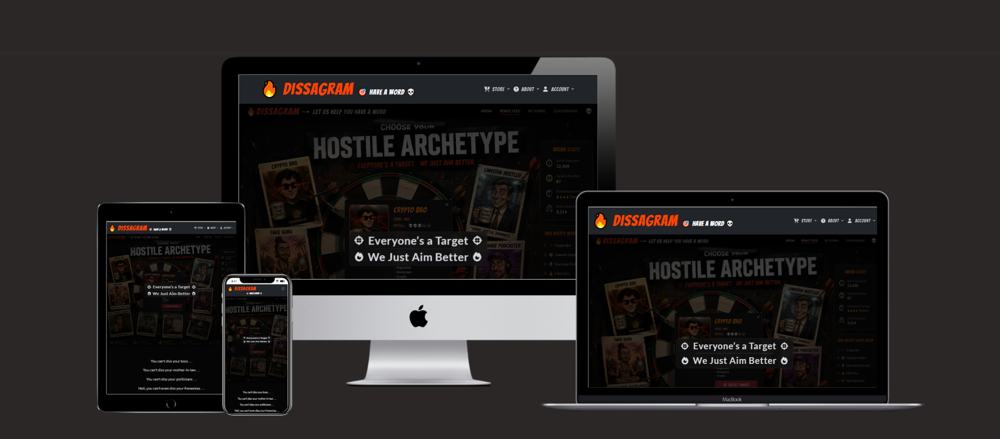</h3>

<br>

Dissagram is a satirical "Diss card" game, giving users the chance to assemble premium, professionally-crafted insults against a rotating cast of universally recognizable archetypes — the Fake Guru, the Gym Narcissist, the Player, the Pick-Me Bunny, the Super Karen etc. 

After selecting an archetype card, users can choose the voice the Diss is delivered in, the Diss lines they find most amusing and a selection of Premium Diss Categories ro round off their comedic burn.

After finalizing how their Diss will look, the users can either keep it as a private trading card or publish it publicly as a Roast for the community to enjoy. Very soon, users will be able to deploy the cards as Roasts to anyone they believe their archetype card and amusing diss lines might resemble..

It's part trading-card game, part roast battle, and part cathartic release valve when certain people in your life deserve a light ribbing.

Get started right here: ([Dissagram](https://dissagram-75687e7c9019.herokuapp.com/))

<br>
<br>

# Table of Contents

## Contents

- [Table of Contents](#table-of-contents)
- [Purpose & Value](#purpose--value)
- [User Stories](#user-stories)
  - [Visitor Goals](#visitor-goals)
- [Design](#design)
  + [Colour Scheme](#colour-scheme)
  + [Typography](#typography)
  + [Imagery](#imagery)
  + [Icons](#icons)
- [Structure](#structure)
- [Features](#features)
    + [Current Features](#current-features)
    + [Future Features](#future-features)
- [Wireframes](#wireframes)
- [Database Schema](#database-schema)
  + [Schema Rationale](#schema-rationale)
  + [ERD](#erd)
  + [Core Architectural Decisions](#core-architectural-decisions)
- [Security Overview](#security-overview)
- [Technologies](#technologies)
  + [Languages](#languages)
  + [Frameworks, Libraries & Programs](#frameworks-libraries--programs)
- [Testing](#testing)
  + [Automated Tests](#automated-tests)
  + [Manual Testing](#manual-testing)
  + [Testing User Stories](#testing-user-stories)
  + [Code Validation](#code-validation)
  + [Lighthouse](#lighthouse)
  + [Responsiveness](#responsiveness)
  + [Debugging](#debugging)
- [Deployment](#deployment)
  + [Heroku](#heroku)
  + [Forking the GitHub Repository](#forking-the-github-repository)
  + [Cloning the GitHub Repository](#cloning-the-github-repository)
- [Credits](#credits)
  + [Code](#code)
  + [Media](#media)
  + [Content](#content)
  + [Acknowledgements](#acknowledgements)

<br>
<br>

# Purpose & Value

Dissagram exists for a very specific, very human reason: sometimes you need to say something cutting about the Fake Guru charging £400 for a silence retreat, or the LinkedIn thought-leader who turns redundancy into a "growth chapter" — and you'd like it to sound *good* when you say it.

Rather than leaving users to compose their own insults (badly, in the heat of the moment), Dissagram hands them a curated arsenal: pre-written, professionally "savage" lines, organised by target archetype and delivery style, that can be assembled into a shareable diss card in under two minutes.

The value proposition is threefold:

- **For the user** — a satisfying, funny, low-stakes creative outlet, with a freemium structure that lets them try the product for free before unlocking the full roster of archetypes, voices and premium categories.
- **For the community** — a public Roast Feed where published Roasts pile up against each archetype, turning individual disses into a shared, crowd-sourced takedown.
- **For the business model** — a one-off pack-purchase structure (rather than only subscription) keeps the barrier to entry low, with gifting built in to encourage organic, social growth.

<br>
<br>

# User Stories

## Visitor Goals

"**As a user of Dissagram, I would like** _______________"

:white_check_mark: *successfully implemented*

:x: *not yet implemented*

- :white_check_mark: *an interface layout that can be immediately understood, without the need for complicated instructions or a key*.
- :white_check_mark: *an easy navigation system whereby I can see exactly where I want to get at the click of a nav link*.
- :white_check_mark: *a homepage that clearly explains what the site does and invites me to get started*.
- :white_check_mark: *a "How It Works" page that walks me through the process before I commit to registering*.
- :white_check_mark: *to register for an account and log in securely*.
- :white_check_mark: *to build a diss by picking a target archetype, a roast style and a set of pre-written burn lines*.
- :white_check_mark: *a visual, trading-card-style way of browsing archetypes, rather than a plain dropdown list*.
- :white_check_mark: *archetypes split logically (e.g. by gender) so I can find the one I want quickly*.
- :white_check_mark: *to see which archetypes, roast styles and diss categories are locked, and a clear path to unlock them*.
- :white_check_mark: *a free tier so I can try the product before paying anything*.
- :white_check_mark: *to purchase a pack to unlock more content, with a clear breakdown of what I'm getting*.
- :white_check_mark: *to pay securely using a trusted, well-known payment provider*.
- :white_check_mark: *to be told clearly whether my payment succeeded or failed, with a helpful message either way*.
- :white_check_mark: *an order confirmation email after a successful purchase*.
- :white_check_mark: *to view a history of everything I've ordered*.
- :white_check_mark: *to cancel a pending order, and reinstate it if I change my mind*.
- :white_check_mark: *to gift a pack to another registered user*.
- :white_check_mark: *to save a diss as a private draft before deciding whether to share it*.
- :white_check_mark: *to edit a diss after creating it*.
- :white_check_mark: *to delete a diss I no longer want*.
- :white_check_mark: *to publish my diss publicly as a "Roast" for others to see*.
- :white_check_mark: *to recall a deployed Roast back to draft if I change my mind*.
- :white_check_mark: *to browse a public feed of all deployed Roasts, filterable by archetype and roast style*.
- :white_check_mark: *to view a dedicated public page for each archetype, showing every Roast deployed against them*.
- :white_check_mark: *clear, animated, non-intrusive notifications when I take an action (success, error, info)*.
- :white_check_mark: *to view and edit my own arena profile*.
- :white_check_mark: *to get in touch with the Dissagram team via a contact form, with a reason for my enquiry*.
- :white_check_mark: *to use the site on any device — mobile, tablet or desktop*.

- :x: *to leave comments on public Roasts*.
- :x: *to rate Roasts out of 5 flames, feeding into a leaderboard*.
- :x: *to see a leaderboard of the most-roasted archetypes and highest-rated burns*.
- :x: *to subscribe to a monthly "Roast Pack" for unlimited access and exclusive monthly drops*.
- :x: *to gift a pack to someone by email, even if they don't yet have an account*.
- :x: *to reply to a Roast with a "Riposte" of my own, building a chain*.
- :x: *to access a Battle Arena where users can go head-to-head*.
- :x: *to physically purchase a Dissagram board game*.

<br>
<br>

# Design

-   ## Colour Scheme

    -   Dissagram's palette is built around a near-black background with hot orange, ember-gold and crimson accents — designed to feel like a late-night roast battle: punchy, a little dangerous, but legible and confident rather than garish. Off-white text keeps body copy comfortable to read against the dark base.

    <h3 align="center">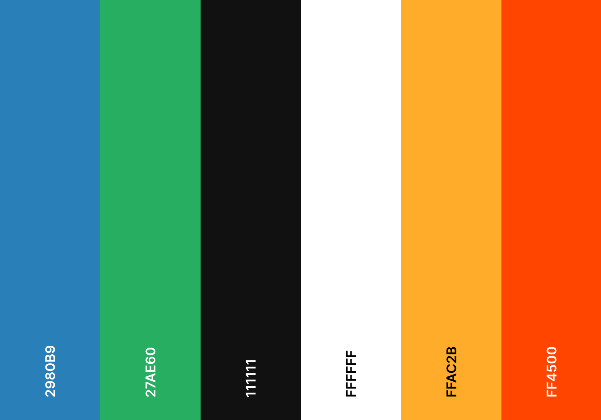</h3>

    [Palette URL](https://coolors.co/2980b9-27ae60-111111-ffffff-ffac2b-ff4500)

-   ## Typography

    1) **Display / Brand Font**

         -   [Bangers](https://fonts.google.com/specimen/Bangers), a bold comic-style display font, is used for the logo, headings, buttons and badges — reinforcing the punchy, comic-book "roast" tone across the entire site.

        <h3 align="center"></h3>

    2) **Heading Accent Font**

         -   [DM Serif Display](https://fonts.google.com/specimen/DM+Serif+Display) is used sparingly for selected editorial headings, lending a touch of mock-seriousness that plays against the comic tone.

        <h3 align="center"></h3>

    3) **Body Font**

         -   [Lato](https://fonts.google.com/specimen/Lato) is used for all body text, form labels, descriptions and navigation — a clean, highly-readable sans-serif that keeps long-form content (diss lines, traits, custom notes) comfortable to read.

        <h3 align="center"></h3>

-   ## Imagery

    ### Homepage Hero

    The homepage features a bold, fire-themed hero image introducing the Dissagram concept, leading straight into a call to action.

    <h3 align="center">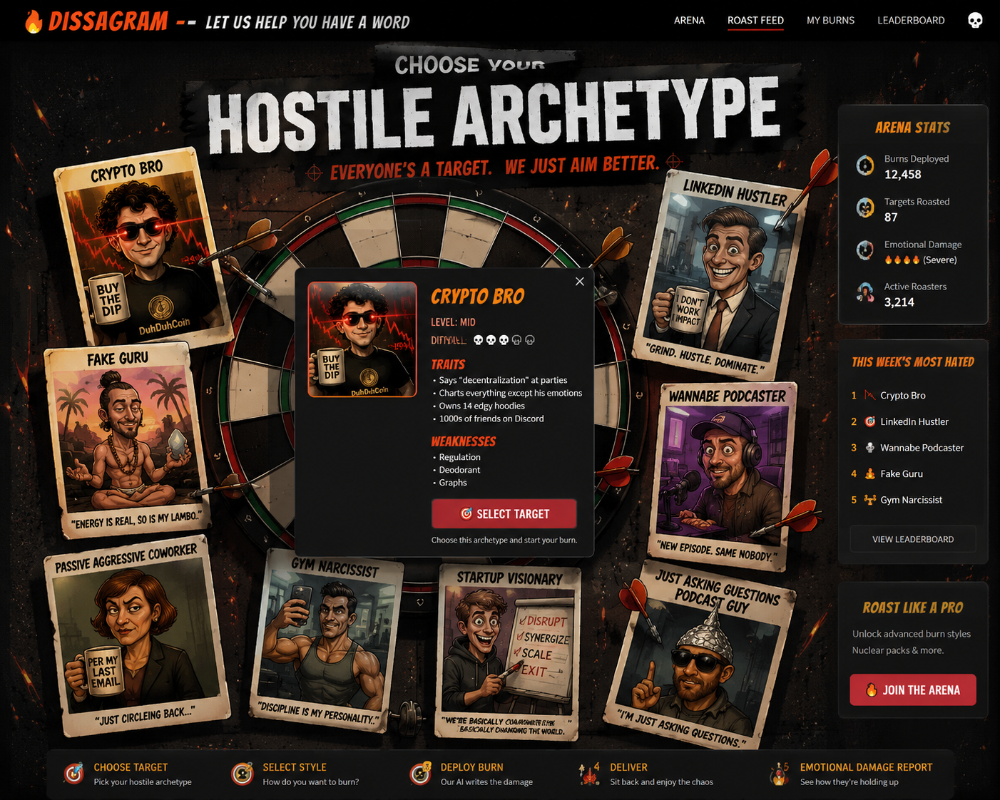</h3>

    ### Archetype Trading Cards

    Each Target Archetype (Fake Guru, Gym Narcissist, Pick-Me Bunny, etc.) is illustrated as a full trading-card-style artwork, complete with traits, weaknesses and a catchphrase — these form the visual core of the Build Your Diss carousel and the Diss Detail page.

    <h3 align="center">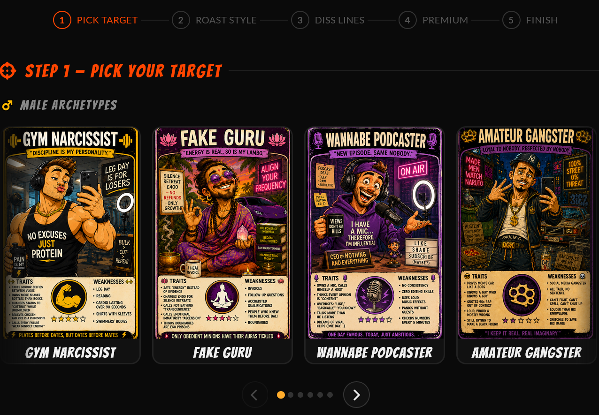</h3>

    ### Roast Style Avatars

    Each Roast Style (Shakespearean Savage, Battle Rapper, Haughty Headmistress, etc.) is illustrated as a circular persona avatar, used throughout the diss builder and on every published diss card.

    <h3 align="center"></h3>

-   ## Icons

    ### Font Awesome Icons

    [Font Awesome](https://fontawesome.com/) icons are used throughout the navbar, page headers, action buttons and footer social links, to improve clarity and reduce visual clutter.

    <h3 align="center">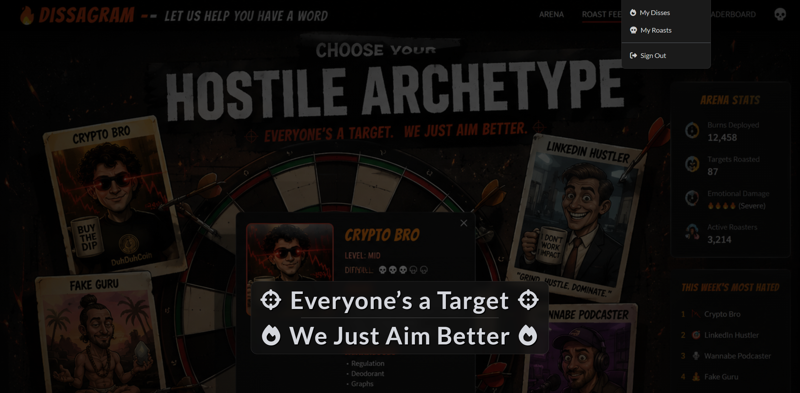</h3>

    ### Emoji as UI Language

    Emoji are used deliberately as a lightweight visual language across the site — 🔥 for fire/burns, 🔒 for locked content, 🎁 for gifting, ✅/❌ for toast states — keeping the tone playful while remaining instantly readable.

<br>
<br>

# Structure

-   Dissagram is structured as a Django full-stack web application, with the following main sections:

<br>

| Page | Description |
|------|-------------|
| Home | Landing page introducing the concept with a hero image and call to action |
| How It Works | Static explainer page walking new users through the diss-building process |
| Sign In / Register | Authentication pages powered by django-allauth, restyled to match the Dissagram aesthetic |
| Get Your Pack | Pack store — Diss Pack, Roast Pack and a "Coming Soon" Roast Pack subscription teaser |
| Checkout | Stripe-hosted Checkout session for purchasing a pack |
| Pack Unlocked | Post-purchase confirmation page |
| My Orders | Dashboard of the logged-in user's order history, with cancel / reinstate / delete options and gifting stats |
| Build a Diss | The 5-step diss builder — Pick Target → Roast Style → Roast Lines → Premium Category → Final Touches |
| Edit Diss | Same builder, pre-populated with an existing diss's saved values |
| My Disses | Dashboard of the logged-in user's disses, with CRUD and Deploy/Recall Roast actions |
| Diss Detail | Trading-card-style view of a single diss |
| Roast Feed | Public feed of all deployed Roasts, filterable by archetype and roast style |
| Roast Detail | Public pile-on page for a single archetype, showing every Roast deployed against them |
| My Roasts | Dashboard of the logged-in user's own published (deployed) disses |
| Profile / Edit Profile | The logged-in user's arena profile — bio, avatar and favourite roast style |
| Contact | Contact form with categorised enquiry reasons |
| Sign Out | Log out of the website |

<br>

# Irregular Structure

## Embedded CSS

Most page-specific CSS lives in `` within individual templates rather than the global stylesheet. This was a deliberate choice for pages with highly distinct visual treatments (the diss builder, the diss detail trading card, the packages page) so that styles stay co-located with the markup they affect, and so the global `style.css` stays focused on shared, site-wide rules (navbar, footer, base typography).

<br>
<br>

# Features

-   ## Current Features

### Landing Page

The homepage introduces Dissagram with a bold hero image and a clear call to action, immediately communicating the site's purpose to a first-time visitor.

<h3 align="center"></h3>

### How It Works

A dedicated explainer page breaks down the diss-building process step by step for new users before they commit to registering.

<h3 align="center">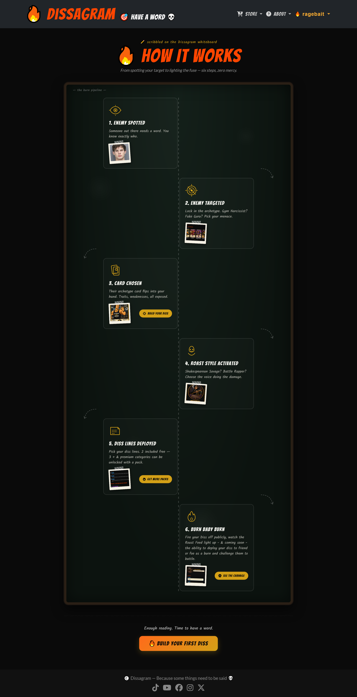</h3>

### Authentication

Full user authentication is handled by [django-allauth](https://django-allauth.readthedocs.io/), with custom-styled login, signup and logout templates matching Dissagram's dark, fire-themed aesthetic rather than allauth's plain defaults.

<h3 align="center"></h3>

### Get Your Pack — Freemium Store

A pack store offering the Diss Pack (starter) and Roast Pack (best value), each unlocking a defined number of archetypes, roast styles, premium diss categories and Deploy Roasts. A greyed-out "Coming Soon" Roast Pack subscription card previews a planned future tier without being purchasable.

<h3 align="center">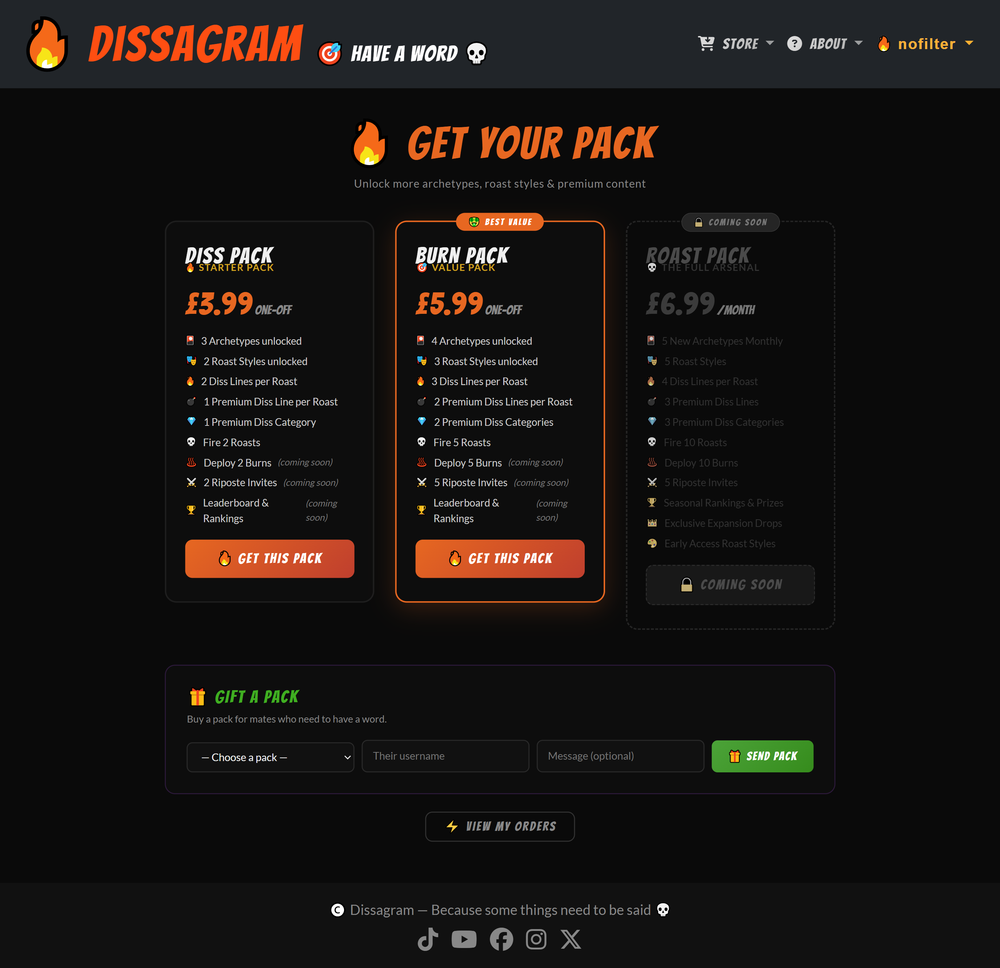</h3>

Already-purchased packs are clearly marked with a green border and a "Purchased" badge, with the call-to-action button switching to "Gift This Pack" — encouraging organic growth rather than confusing repeat-purchase prompts.

<h3 align="center">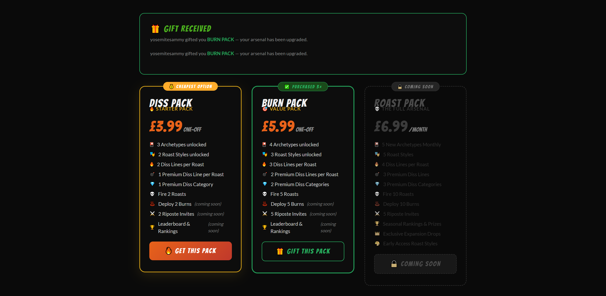</h3>

### Stripe Checkout & Order Confirmation

Purchases are processed through [Stripe Checkout](https://stripe.com/payments/checkout) (hosted), with order creation handled **exclusively inside the Stripe webhook handler** — never on the client-facing success URL. This is a deliberate security improvement: it means an order can never be marked "complete" by a user simply visiting a success URL without an actual confirmed payment from Stripe.

<h3 align="center">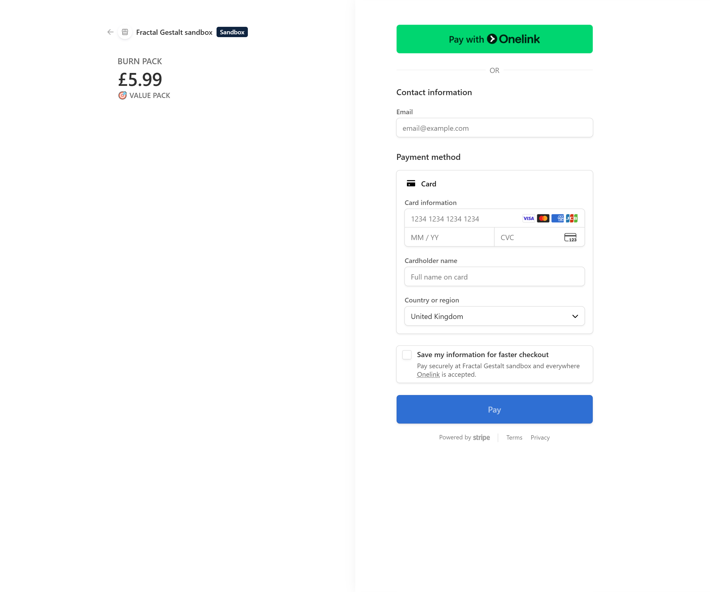</h3>

A clear "Pack Unlocked" confirmation page greets the user immediately after a successful payment, and an order confirmation email is sent automatically (printed to console in development, sent via SMTP in production).

<h3 align="center">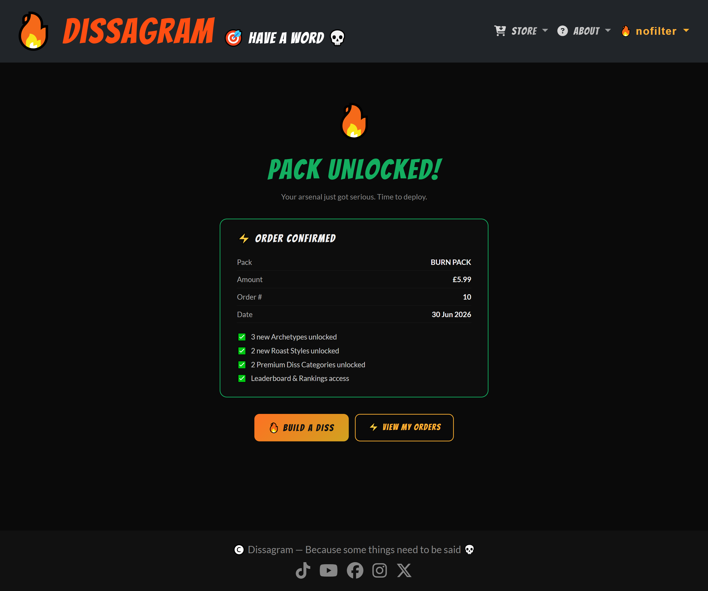</h3>

### Order History

A personal dashboard listing every order the user has placed, with colour-coded status pills, the ability to cancel a pending order, reinstate a cancelled order, or permanently delete failed/cancelled orders. Completed orders can never be deleted, preserving an accurate financial record.

<h3 align="center"></h3>

### Gift a Pack

Users who own at least one pack can gift any pack to another registered Dissagram user by username.

<h3 align="center"></h3>

### Build Your Diss — 5-Step Builder

The centrepiece of the platform. A progressive, 5-step diss builder:

1. **Pick Your Target** — a dual carousel (♂ Male Archetypes / ♀ Female Archetypes) of illustrated trading-card archetypes, with locked archetypes clearly greyed out and a friendly toast nudging the user toward the pack store.
2. **Roast Style** — a grid of illustrated persona avatars representing the voice the diss will be delivered in.
3. **Pick Your Roast Lines** — standard diss lines for the chosen archetype + roast style combination, with a live selection counter respecting the user's pack-tier limit.
4. **Pick Your Extra Diss Category** — premium categories (LinkedIn Endorsement, Internal Monologue, etc.), shown only when the user has unlocked them and only when premium lines actually exist for that archetype.
5. **Final Touches** — an optional custom note and a Draft / Published visibility toggle.

<h3 align="center"></h3>

### Diss Detail — Trading Card View

Each saved diss is rendered as a trading card: the archetype's full illustrated artwork, a roast-style "speech bubble" badge, traits and weaknesses, the selected burn lines (standard lines before premium), and an optional personal note.

<h3 align="center"></h3>

### My Disses Dashboard

A personal dashboard listing every diss the user has created, with inline View / Edit / Deploy / Recall / Delete actions.

<h3 align="center">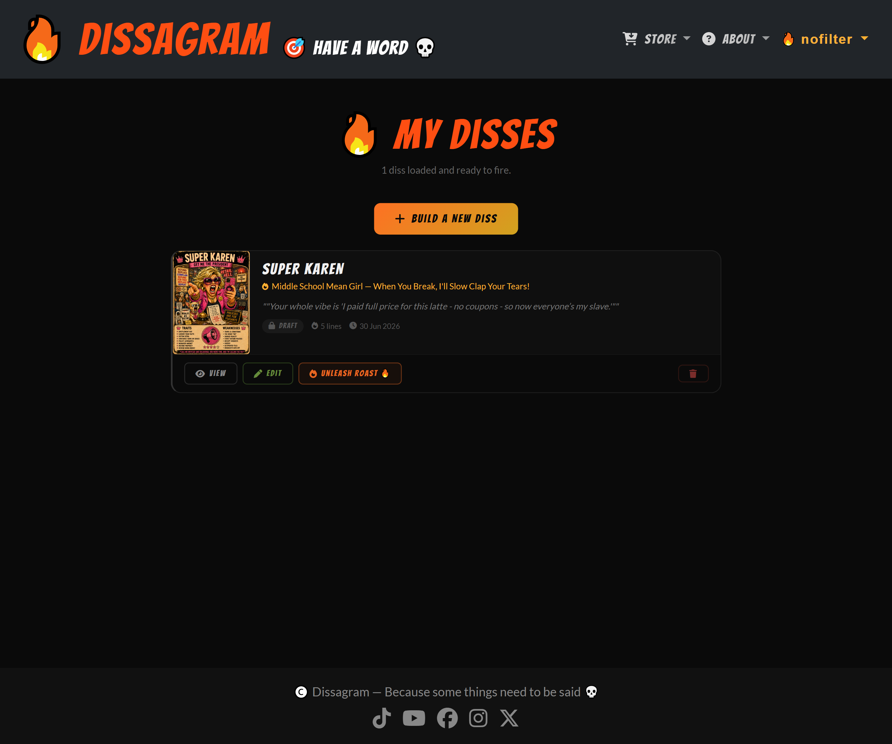</h3>

### Deploy Roast / Recall Roast

A single click publishes a diss publicly as a "Roast" against its target archetype. The first Roast deployed against any archetype automatically creates a public Roast page for that archetype; subsequent Roasts simply join the existing pile-on. Roasts can be recalled back to draft at any time.

<h3 align="center"></h3>

### Roast Feed

A public, browsable feed of every archetype with at least one deployed Roast, with a stacked-card visual effect and filters by archetype and roast style.

<h3 align="center"></h3>

### Roast Detail — Public Pile-On Page

A dedicated public page per archetype, aggregating every Roast the community has deployed against them, filterable by roast style.

<h3 align="center">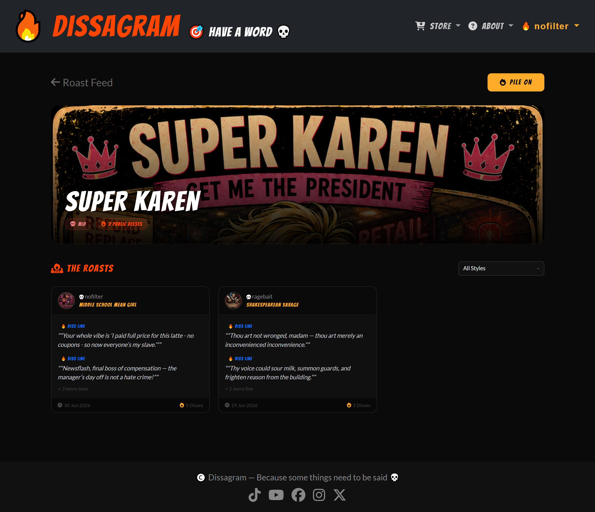</h3>

### Global Toast Notification System

A custom-built toast notification system, hooked into Django's messages framework, replaces standard Bootstrap alerts site-wide. Toasts animate in, auto-dismiss after a few seconds, and are colour-coded by message type (success / error / info / warning) — used for payment confirmation, locked-content nudges, selection-limit warnings, order actions and form feedback.

<h3 align="center"></h3>

### Arena Profile

Every registered user has an extended "Disser" profile — a bio, avatar and favourite roast style — viewable and editable separately from their core account details.

<h3 align="center">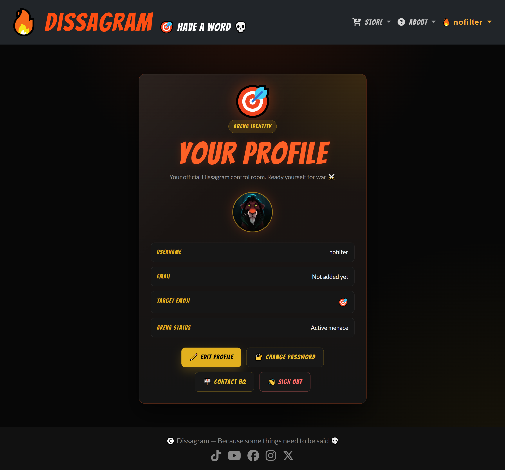</h3>

### Contact Page

A categorised contact form (general enquiry, account issue, packs/orders, payment problem, bug report, safety/moderation, collab, other) allowing any visitor to get in touch, with submissions stored in the database for follow-up.

<h3 align="center">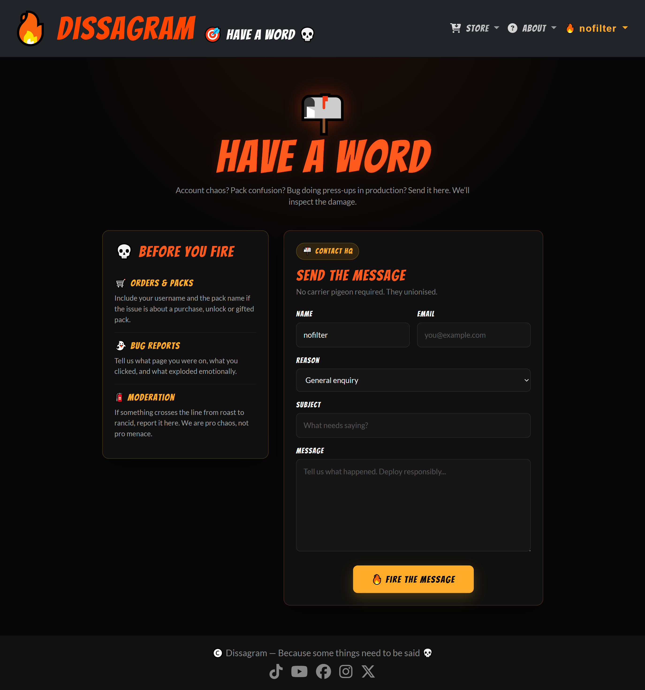</h3>

### Responsive Design

Dissagram is fully responsive across all screen sizes — mobile, tablet and desktop. Please see screenshots under [Responsiveness](#responsiveness).

<br>

-   ## Future Features

- :x: *Comments on public Roasts — short community reactions on deployed disses*
- :x: *A 1–5 flame rating system on Roasts, feeding into a community leaderboard*
- :x: *A leaderboard ranking the most-roasted archetypes and highest-rated Roasts*
- :x: *A monthly "Roast Pack" subscription tier with unlimited Deploy Roasts and exclusive monthly archetype drops*
- :x: *Gifting a pack by email address, so the recipient doesn't need an existing account*
- :x: *Riposte chains — replying to a Roast with a Roast of your own*
- :x: *A Battle Arena for head-to-head roast contests*
- :x: *A physical Dissagram card/board game, building on the digital archetype roster*

<br>
<br>

# Wireframes

-   ## Homepage

<h3 align="center">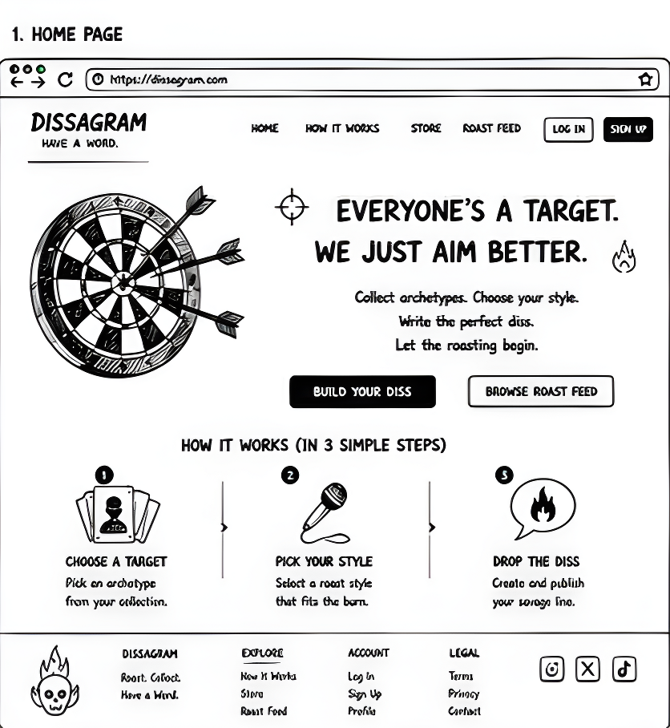</h3>

-   ## Homepage

<h3 align="center">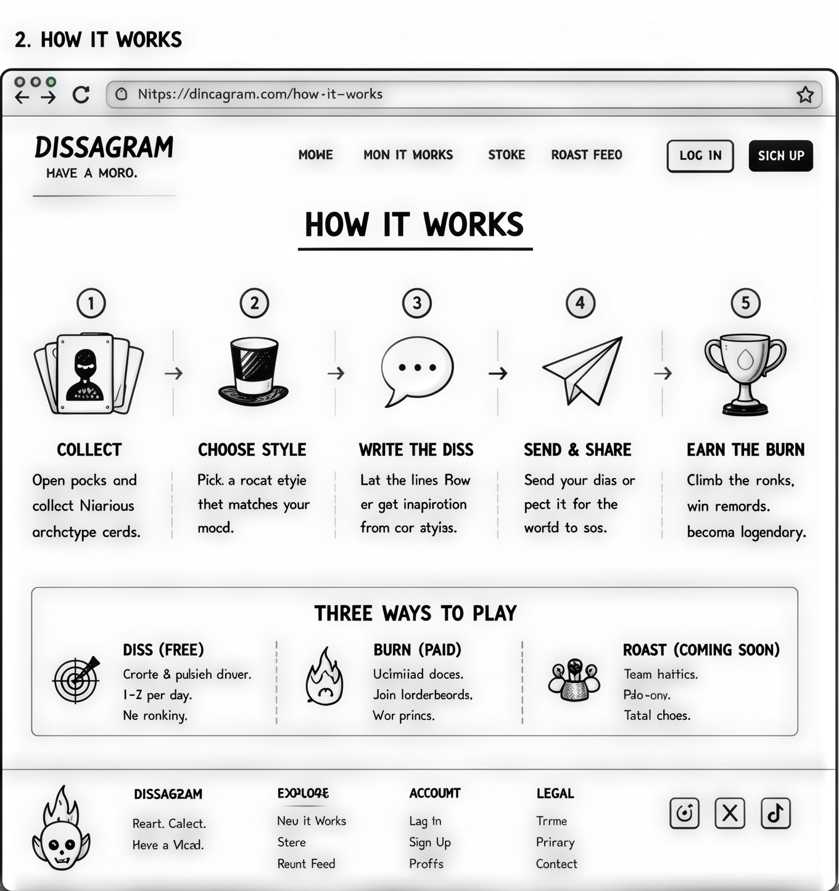</h3>

-   ## Homepage

<h3 align="center">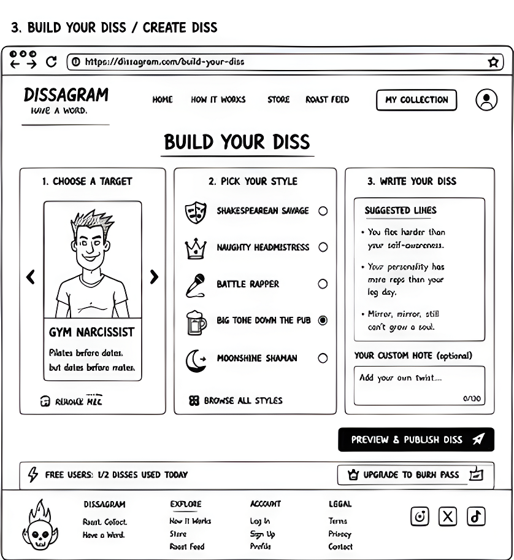</h3>

-   ## Homepage

<h3 align="center">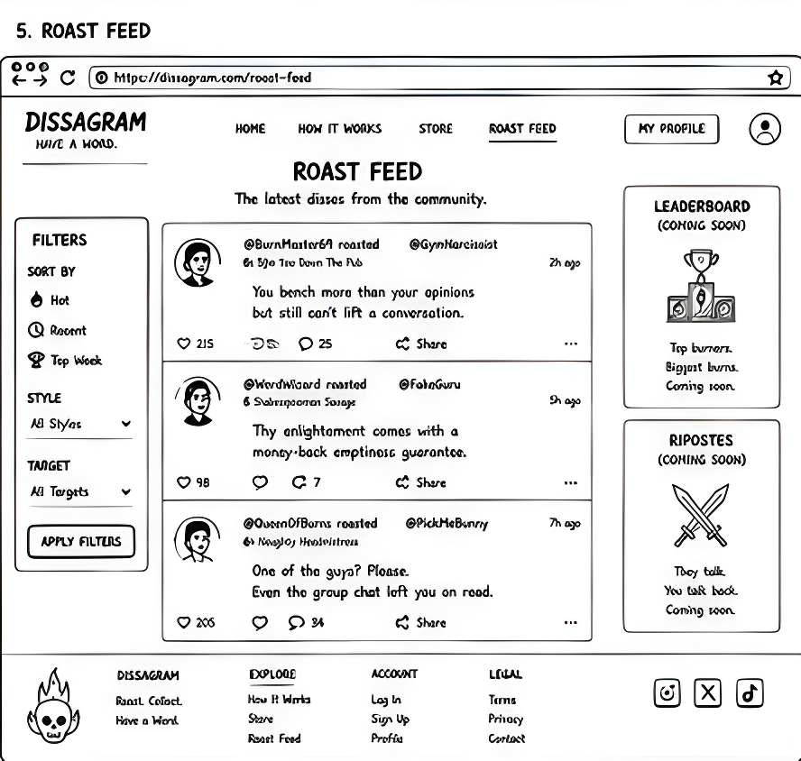</h3>

-   ## Homepage

<h3 align="center">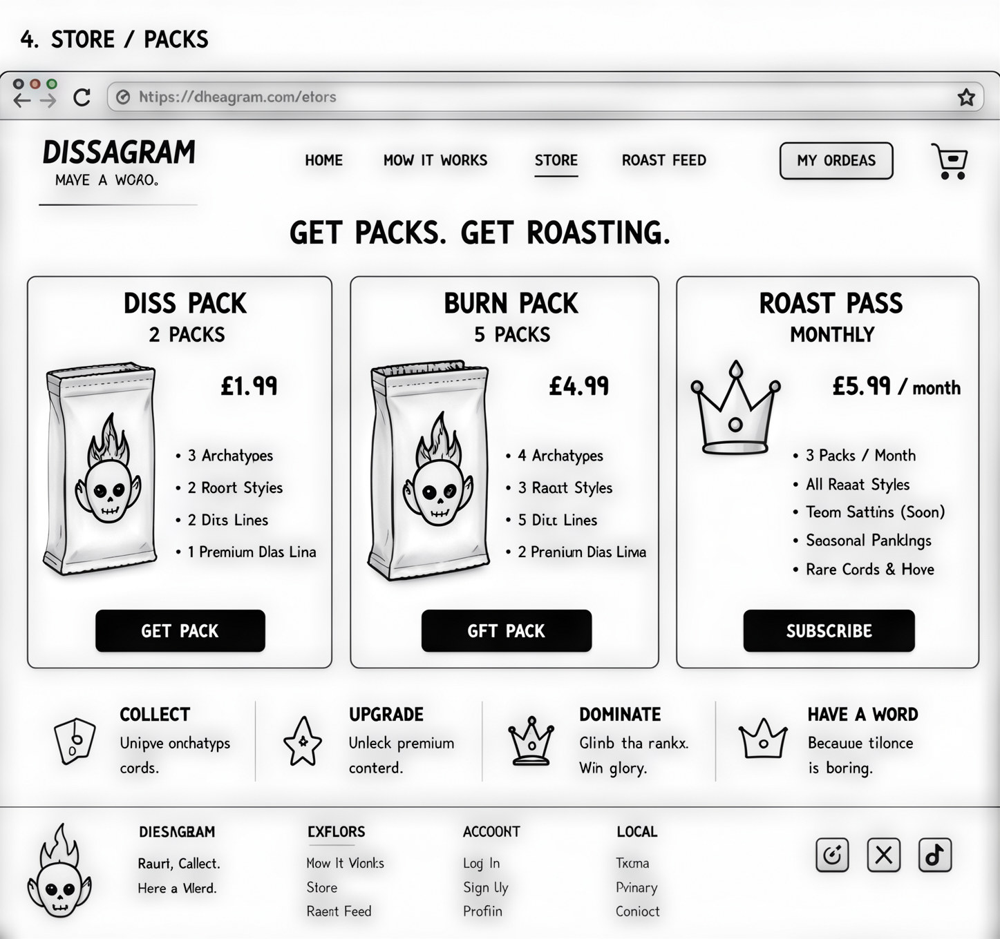</h3>

<br>
<br>

# Database Schema

## Schema Rationale

Dissagram's data model is built around a clear separation between **content** (archetypes, roast styles, diss lines — all admin-managed) and **user-generated assembly** (a Diss is simply a user's chosen combination of that content). Sitting alongside this is a commerce layer (Package / Order) that gates access to content via a freemium pack system, and a publishing layer (Roast) that aggregates user-generated Disses into public, archetype-level pages.

This approach allows:

- admins to expand the archetype/roast-style/diss-line roster without touching code,
- users to freely build and re-build private disses without affecting anything public,
- a single click to "publish" a diss as a community-visible Roast,
- and a clean freemium boundary that can be checked from a handful of small, reusable helper functions rather than scattered permission checks.

The database structure prioritises:

- a tight content/assembly separation (so freemium logic only has to live in one place),
- ownership security (every CRUD operation is filtered by `request.user`),
- zero-cost extensibility for premium content (via a proxy model, not a new table),
- and a clean foundation for the planned ratings/leaderboard system.

---

## ERD

```text
+--------------------+
| User (Django)      |
+--------------------+
| id                  |
| username            |
| email               |
| password            |
+--------------------+
        |
        | 1-to-1
        v
+--------------------+        +--------------------+
| Disser             |        | ContactMessage      |
+--------------------+        +--------------------+
| id                  |        | id                  |
| user_id (FK)        |        | user_id (FK, null)  |
| bio                 |        | name                |
| avatar              |        | email                |
| favourite_style(FK) |        | reason               |
| burns_deployed      |        | subject              |
| created_on          |        | message              |
+--------------------+        | is_resolved          |
                                | created_on           |
                                +--------------------+

+--------------------+      +--------------------+      +--------------------+
| TargetArchetype     |      | RoastStyle          |      | RoastCategory        |
+--------------------+      +--------------------+      +--------------------+
| id                   |      | id                   |      | id                   |
| name                 |      | name                 |      | name                 |
| slug                 |      | slug                 |      | emoji                |
| description          |      | tagline              |      | display_order        |
| traits               |      | description          |      | is_free              |
| weaknesses           |      | example_line         |      | required_pack_level  |
| difficulty_level     |      | emoji                |      +--------------------+
| catchphrase          |      | display_order        |
| avatar               |      | is_free              |
| display_order        |      | avatar               |
| is_free              |      +--------------------+
| gender               |
+--------------------+
        |
        | 1-to-many
        v
+----------------------------------------+
| DissLine                                |
+----------------------------------------+
| id                                       |
| category_id (FK -> RoastCategory)        |
| archetype_id (FK -> TargetArchetype)      |
| roast_style_id (FK -> RoastStyle, null)  |
| content                                  |
| status                                   |
| suggested_by (FK -> User, null)          |
| is_free                                  |
| display_order                            |
+----------------------------------------+
        ^
        | proxy model (same table)
        |
+--------------------+
| PremiumDissLine     |
| (proxy of DissLine) |
+--------------------+


+----------------------------------------+
| Diss                                    |
+----------------------------------------+
| id                                       |
| author_id (FK -> User)                   |
| target_archetype_id (FK)                  |
| roast_style_id (FK)                      |
| selected_lines (M2M -> DissLine)          |
| custom_note                              |
| status (draft / published)               |
| is_public                                |
| parent_diss_id (FK -> self, null)         |
| is_riposte                               |
| created_on / updated_on                  |
+----------------------------------------+
        |
        | 1-to-1 (per archetype, first Deploy Roast)
        v
+--------------------+
| Roast               |
+--------------------+
| id                   |
| archetype_id (FK,    |
|   OneToOne)          |
| slug                 |
| intro                |
| is_published         |
| created_on           |
+--------------------+


+--------------------+        +----------------------------------------+
| Package             |        | Order                                    |
+--------------------+        +----------------------------------------+
| id                   |        | id                                        |
| name                 |        | user_id (FK)                              |
| tagline              |        | package_id (FK, null)                     |
| price                |        | diss_id (FK, null, OneToOne)               |
| description          |        | stripe_payment_id                          |
| archetype_count      |  1-to- | amount_paid                                |
| roast_style_count    |  many  | status (pending/complete/failed/refunded)  |
| premium_category_count|  ---> | gifted_to (FK -> User, null)               |
| deploy_burn_count    |        | gift_message                               |
| riposte_count        |        | created_on                                 |
| includes_leaderboard |        +----------------------------------------+
| max_line_selections  |
| display_order        |
| is_active             |
+--------------------+
```
<br>

-   Original ERD generated during planning

<h3 align="center">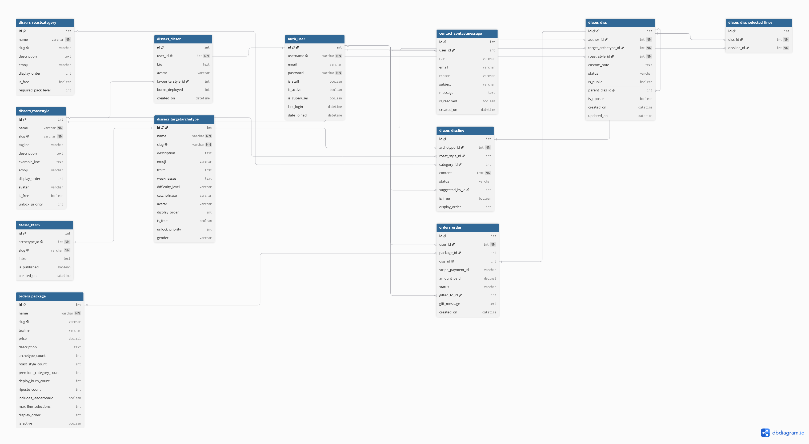</h3>

<br>
<br>

# Core Architectural Decisions

## 1. Webhook-Only Order Confirmation

An `Order` is only ever created or marked `"complete"` inside the Stripe webhook handler (`stripe_webhook`) — never on the client-facing success URL.

### Rationale

This is a direct, deliberate improvement over the Boutique Ado walkthrough pattern, where order confirmation can be more tightly coupled to the client redirect. By moving order creation entirely server-side and triggering it only from a **signature-verified** Stripe event:

- a user cannot manufacture a "successful" order by visiting `/orders/success/` directly without paying,
- a dropped connection on the user's side after payment still results in a correctly recorded order,
- and the success page becomes purely a UX confirmation, with zero responsibility for actual order state.

---

## 2. DissLine + PremiumDissLine Proxy Model

`PremiumDissLine` is a Django **proxy model** of `DissLine` — same database table, zero extra migration.

### Rationale

Standard diss lines (tied to a specific archetype + roast style) and premium diss lines (category-only, applicable to any roast style) are conceptually different content types for admin users, but identical in data shape. Rather than duplicating the table or forcing admins to manage both content types through one confusing form, the proxy model gives Premium content its own dedicated "Add" entry point in Django admin — with `roast_style` hidden and force-saved as `None` — while `DissLine` itself keeps `roast_style` required. This is purely an admin-UX decision with no schema cost.

---

## 3. Freemium Gating via Small, Reusable Helpers

Freemium logic (which archetypes/styles/categories a user can see) lives entirely in a handful of small helper functions in `disses/views.py` — `_get_user_pack_level`, `_get_accessible_category_names`, `_get_user_unlocked_counts`, `_get_max_line_selections` — rather than being checked inline, repeatedly, across templates and views.

### Rationale

This keeps the "what has this user unlocked?" question answerable from one place. Every part of the diss builder — the archetype carousel, the roast style grid, the diss line list, the selection limit — calls into the same small set of functions, so a future change to pack tiers only needs to happen once.

---

## 4. Roast as an Aggregation Layer, Not a Duplicate of Diss

A `Roast` is not a copy of diss content — it's a thin, auto-created public page per `TargetArchetype` that queries and aggregates all public, published `Diss` objects targeting that archetype on demand.

### Rationale

This mirrors the principle (used previously in Hip Trip Hooray's Trip → Itinerary split) of keeping private, editable user content separate from its public representation — but adapted here to a many-to-one relationship: many private Disses can feed into one public Roast page per archetype, rather than each Diss generating its own separate public copy. This avoids data duplication and means the Roast page is always live and current.

---

## 5. Custom Toast System Instead of Bootstrap JS Alerts

All Django `messages` framework output renders through a custom CSS-animated toast component, rather than Bootstrap's dismissible alert component.

### Rationale

This removes a dependency on Bootstrap's JavaScript bundle for a purely cosmetic feature, gives full control over animation timing and auto-dismiss behaviour, and keeps the visual language consistent with Dissagram's bespoke dark theme rather than Bootstrap's default alert styling.

<br>
<br>

# Security Overview

## Authentication Security

Dissagram uses [django-allauth](https://django-allauth.readthedocs.io/) on top of Django's built-in authentication framework.

### Features

- hashed passwords
- session-based authentication
- CSRF protection on every form
- `@login_required` on all create/edit/delete/order/profile views
- secure, allauth-managed login/logout handling

Unauthenticated users are redirected to the login page when attempting to access any protected route.

---

## Ownership-Based Permissions

Every object a user can edit or delete is fetched filtered by ownership — a non-admin user can never retrieve, view, edit or delete another user's private content via URL manipulation.

### Example Logic

```python
diss = get_object_or_404(Diss, pk=pk, author=request.user)
order = get_object_or_404(Order, pk=order_id, user=request.user)
```

---

## Payment Security

- The Stripe **secret key** and **webhook signing secret** are never exposed client-side.
- Every incoming webhook event is verified using `stripe.Webhook.construct_event()` against the signing secret — a request claiming to be a Stripe event without a valid signature is rejected with a `400` before any database write occurs.
- Order status is set server-side only, inside the webhook handler (see [Core Architectural Decisions](#core-architectural-decisions)).

---

## Secrets Management

- All secret keys (`SECRET_KEY`, Stripe keys, email credentials, Cloudinary credentials) are stored in environment variables, loaded locally via a git-ignored `env.py` and set as Config Vars on Heroku in production.
- `db.sqlite3`, `env.py`, `media/`, and `venv/` are all excluded via `.gitignore` — no secrets or local data are ever committed to the repository.
- `DEBUG` is controlled entirely via an environment variable and **must be set to `False`** in the production Heroku Config Vars.

<br>
<br>

# Technologies

## Languages

- [HTML5](https://developer.mozilla.org/en-US/docs/Web/HTML)
- [CSS3](https://developer.mozilla.org/en-US/docs/Web/CSS)
- [JavaScript](https://developer.mozilla.org/en-US/docs/Web/JavaScript)
- [Python 3.12](https://www.python.org/)

## Frameworks, Libraries & Programs

- [Django 6.0](https://www.djangoproject.com/) — the core web framework
- [PostgreSQL](https://www.postgresql.org/) — production database, hosted on [Neon](https://neon.tech/)
- [Stripe](https://stripe.com/) — payment processing via Stripe Checkout (hosted) and webhooks
- [Cloudinary](https://cloudinary.com/) — cloud media storage for user-uploaded and admin-uploaded images in production
- [Whitenoise](https://whitenoise.readthedocs.io/) — static file serving in production
- [django-allauth](https://django-allauth.readthedocs.io/) — user authentication
- [django-crispy-forms](https://django-crispy-forms.readthedocs.io/) + [crispy-bootstrap5](https://github.com/django-crispy-forms/crispy-bootstrap5) — form rendering
- [dj-database-url](https://pypi.org/project/dj-database-url/) — database URL parsing for Heroku
- [Gunicorn](https://gunicorn.org/) — WSGI HTTP server for production
- [Pillow](https://pypi.org/project/pillow/) — image handling
- [Bootstrap 5](https://getbootstrap.com/) — base responsive grid and components
- [Font Awesome](https://fontawesome.com/) — icons
- [Google Fonts](https://fonts.google.com/) — Bangers, DM Serif Display, Lato
- [Heroku](https://www.heroku.com/) — cloud deployment platform
- [Git](https://git-scm.com/) — version control
- [GitHub](https://github.com/) — code repository
- [Stripe CLI](https://stripe.com/docs/stripe-cli) — local webhook testing during development

<br>
<br>

# Testing

The Dissagram website has been tested using the following methods:

- [Automated Tests](#automated-tests)
- [Manual Testing](#manual-testing)
- [Testing User Stories](#testing-user-stories)
- [Code Validation](#code-validation)
    - [W3C HTML Validator](#w3c-html-validator)
    - [W3C CSS Validator](#w3c-css-validator)
    - [JSHint JavaScript Validator](#jshint-javascript-validator)
    - [PEP8 / Python Validation](#pep8--python-validation)
- [Lighthouse](#lighthouse)
- [Responsiveness](#responsiveness)
- [Debugging](#debugging)
    - [Resolved](#resolved)
    - [Known Issues](#known-issues)

<br>

**Return to TOC at the top:**

- [Table of Contents](#table-of-contents)

<br>
<br>

## Importance of Automated & Manual Testing

### Automated

**Using automated testing to test code has several advantages over manual testing:**

* Quicker — multiple tests can be run on the same piece of code concurrently, and in a short space of time.

* More holistic — the ability to very quickly establish how the site will perform as a whole.

* More exact — the ability to find more bugs, including unknown bugs.

* More accurate — less room for human error; tests are only as good as the tester(s), and can therefore end up being purely decorative.

* More honest — less prone to manipulation or corruption.

### Manual

**Using manual testing to test code has several advantages over automated testing:**

* More precise — no waiting for other tests to finish; one specific piece can be perfected.

* More initiative — tests can be written while programming, so that errors can be picked up as early as possible during development.

* More adaptive / flexible — tests can remain within the codebase for the future (*regressive testing*), so that if future developments conflict with current functionality, the programmer is alerted immediately.

* More organic — automated tests don't test the User Experience beyond the performative, so manual testing is essential for a full picture of UX.

<br>
<br>

## Automated Tests

Automated Django tests currently cover the `disses` and `accounts` apps:

- `disses/tests.py` — model-level tests covering `DissLine` (string representation, archetype/roast-style relationships, category, default approval status, ordering, and the approved-only queryset) and `Diss` (string representation, draft-by-default status, private-by-default visibility, author relationship, and empty selected_lines by default).
- `accounts/tests.py` — view-level tests covering the profile page (login-required redirect, successful view for an authenticated user, automatic `Disser` creation on first visit), the profile edit page (login-required access, successful email update, and syncing the updated email to the allauth `EmailAddress` record).

Run all Django tests with:

```bash
python manage.py test
```

or for a specific app:

```bash
python manage.py test disses
python manage.py test accounts
python manage.py test orders
```

Stub `tests.py` files exist in `roasts`, `dissers` and `contact` — these are flagged as a known gap; given the project's tight timeline, testing effort was prioritised on the freemium content-locking logic (`disses`) and the newest, most recently changed area (`accounts`), with the remaining apps covered comprehensively by the manual testing below.

<br>
<br>

## Manual Testing

### Authentication & Permissions

| Test | Action | Expected Result | Pass/Fail |
|---|---|---|---|
| Register new account | Complete signup form | Account created, logged in, redirected to home | ✅ Pass |
| Login with valid credentials | Submit login form | Logged in, redirected correctly | ✅ Pass |
| Login with invalid credentials | Submit incorrect password | Error message shown, not logged in | ✅ Pass |
| Logout | Click Sign Out | Session ended, redirected to home | ✅ Pass |
| Logged-out user cannot access diss builder | Navigate to `/disses/create/` while logged out | Redirected to login page | ✅ Pass |
| User cannot view another user's draft diss | Enter another user's private diss URL directly | 404 returned | ✅ Pass |
| User cannot edit another user's diss | Enter another user's diss edit URL directly | 404 returned | ✅ Pass |
| User cannot cancel another user's order | Enter another user's order-cancel URL directly | 404 returned | ✅ Pass |

---

### Freemium Locking

| Test | Action | Expected Result | Pass/Fail |
|---|---|---|---|
| Free-tier archetype carousel | View Build a Diss as a free user | Free archetypes selectable, paid archetypes shown locked/greyed | ✅ Pass |
| Clicking a locked archetype | Click a greyed-out archetype card | Lock toast appears, redirects to pack store | ✅ Pass |
| Clicking a locked roast style | Click a greyed-out roast style avatar | Lock toast appears, redirects to pack store | ✅ Pass |
| Diss line selection limit | Select more lines than the user's pack allows | Extra checkbox auto-unchecks, limit toast shown | ✅ Pass |
| Premium category visibility (free user) | Reach Step 4 as a free user with no premium lines unlocked | Step 4 section does not render | ✅ Pass |
| Premium category visibility (pack owner) | Reach Step 4 after purchasing a pack with premium access | LinkedIn Endorsement / Internal Monologue lines shown | ✅ Pass |
| Pack level correctly read after purchase | Purchase a pack, return to diss builder | Newly unlocked archetypes/styles immediately selectable | ✅ Pass |

---

### Stripe Checkout & Orders

| Test | Action | Expected Result | Pass/Fail |
|---|---|---|---|
| Successful test payment | Complete checkout with Stripe test card `4242 4242 4242 4242` | Redirected to Pack Unlocked page, order appears as Complete | ✅ Pass |
| Order only created via webhook | Inspect order table immediately after redirect vs after webhook fires | Order only exists once the webhook has processed `checkout.session.completed` | ✅ Pass |
| Order confirmation email sent | Complete a test payment with webhook listener running | Email printed to console (dev) / sent via SMTP (prod) | ✅ Pass |
| Cancelled payment | Cancel out of Stripe Checkout | Returned to packages page with an informational toast, no order created | ✅ Pass |
| Cancel a pending order | Click Cancel on a pending order | Order status changes to Failed, toast confirms | ✅ Pass |
| Reinstate a cancelled order | Click Reinstate on a failed order | Order status returns to Pending, toast confirms | ✅ Pass |
| Delete a failed order | Click Delete on a failed/pending order | Order removed from history | ✅ Pass |
| Cannot delete a completed order | Attempt to delete a completed order | Action blocked, error toast shown | ✅ Pass |
| Gift a pack to a valid username | Submit gift form with an existing username | Redirected to checkout for that pack | ✅ Pass |
| Gift a pack to an invalid username | Submit gift form with a non-existent username | Error toast shown, no checkout triggered | ✅ Pass |
| Already-owned pack shows correct state | View packages page after purchasing a pack | Green border, Purchased badge, Gift This Pack button shown | ✅ Pass |

---

### Diss Builder

| Test | Action | Expected Result | Pass/Fail |
|---|---|---|---|
| Step progression | Select archetype → roast style → lines | Each step reveals the next in sequence, step tracker updates | ✅ Pass |
| Male/female carousel independence | Browse male carousel, then female carousel | Carousels scroll independently, selection badge routes to the correct row | ✅ Pass |
| Edit restores saved state | Open Edit on an existing diss | Archetype, roast style and lines all pre-selected correctly | ✅ Pass |
| Submit without archetype | Attempt to submit with no archetype selected | Submission blocked, alert shown | ✅ Pass |
| Submit without roast style | Attempt to submit with no roast style selected | Submission blocked, field highlighted | ✅ Pass |
| Submit without any lines | Attempt to submit with zero lines checked | Submission blocked, field highlighted | ✅ Pass |
| Draft vs Published toggle | Toggle visibility option before submitting | Correct `status` / `is_public` values saved | ✅ Pass |

---

### Deploy Roast & Roast Feed

| Test | Action | Expected Result | Pass/Fail |
|---|---|---|---|
| Deploy a diss with no lines selected | Attempt to deploy an empty diss | Error toast shown, deploy blocked | ✅ Pass |
| Deploy a valid diss | Deploy a diss with at least one line | Diss marked public/published, Roast created if first for that archetype | ✅ Pass |
| Recall a deployed Roast | Click Recall Roast on a published diss | Diss returns to draft/private | ✅ Pass |
| Roast Feed filter by archetype | Apply archetype filter | Only matching roasts shown | ✅ Pass |
| Roast Feed filter by roast style | Apply roast style filter | Only roasts with a public diss in that style shown | ✅ Pass |
| Roast Detail filter by style | Apply roast style filter on a roast page | Only disses in that style shown | ✅ Pass |

---

### Contact Form

| Test | Action | Expected Result | Pass/Fail |
|---|---|---|---|
| Submit valid contact form | Fill all required fields and submit | Success toast shown, message saved to database | ✅ Pass |
| Submit with missing required field | Omit a required field | Form re-rendered with validation error | ✅ Pass |

---

### Toast Notifications

| Test | Action | Expected Result | Pass/Fail |
|---|---|---|---|
| Success toast | Trigger any success message | Green-bordered toast animates in, auto-dismisses | ✅ Pass |
| Error toast | Trigger any error message | Red-bordered toast animates in, auto-dismisses | ✅ Pass |
| Multiple toasts | Trigger two messages in one request/redirect | Both toasts stack cleanly | ✅ Pass |

---

### Responsive Design

| Test | Device/Width | Expected Result | Pass/Fail |
|---|---|---|---|
| Navigation burger menu | Mobile (< 768px) | Hamburger menu appears, links accessible | ✅ Pass |
| Archetype carousel | Mobile | Cards remain swipeable/scrollable, no horizontal overflow of the page | ✅ Pass |
| Diss builder steps | Mobile | Sections stack cleanly, all interactive elements remain tappable | ✅ Pass |
| Packages grid | Desktop | 3 cards per row | ✅ Pass |
| Packages grid | Tablet | 2 cards per row | ✅ Pass |
| Packages grid | Mobile | 1 card per row | ✅ Pass |
| Diss trading card | Mobile | Card scales to viewport width, text remains legible | ✅ Pass |

<br>
<br>

## Testing User Stories

<br>

| User Story | Result |
|------------|--------|
| Register for an account and log in securely | :white_check_mark: |
| Build a diss using archetype, roast style and burn lines | :white_check_mark: |
| Browse archetypes via a visual, split-by-gender carousel | :white_check_mark: |
| See locked content clearly and be guided to unlock it | :white_check_mark: |
| Purchase a pack securely via Stripe | :white_check_mark: |
| Receive clear feedback on payment success/failure | :white_check_mark: |
| Receive an order confirmation email | :white_check_mark: |
| View and manage order history | :white_check_mark: |
| Gift a pack to another user | :white_check_mark: |
| Save a diss as a draft | :white_check_mark: |
| Edit and delete a diss | :white_check_mark: |
| Deploy a diss publicly as a Roast | :white_check_mark: |
| Recall a deployed Roast | :white_check_mark: |
| Browse the public Roast Feed | :white_check_mark: |
| View a public archetype Roast page | :white_check_mark: |
| Receive clear, animated notifications for my actions | :white_check_mark: |
| View and edit my arena profile | :white_check_mark: |
| Contact the Dissagram team via a form | :white_check_mark: |
| Use the site on mobile, tablet and desktop | :white_check_mark: |

<br>
<br>

## Code Validation

The [W3C Markup Validator](https://validator.w3.org/#validate_by_input) and [W3C CSS Validator](https://jigsaw.w3.org/css-validator/#validate_by_input) were used to validate every page of the project.

### W3C HTML Validator

- Due to the use of Django templating syntax, direct validation of raw template files produces false-positive errors within the W3C validator.
- To ensure accurate validation, rendered HTML output from the browser was validated instead, page by page, after Django had rendered all dynamic content.
- Where appropriate, Django/template-related warnings were filtered during validation review.


<br>

-   ### Home

<h2 align="right">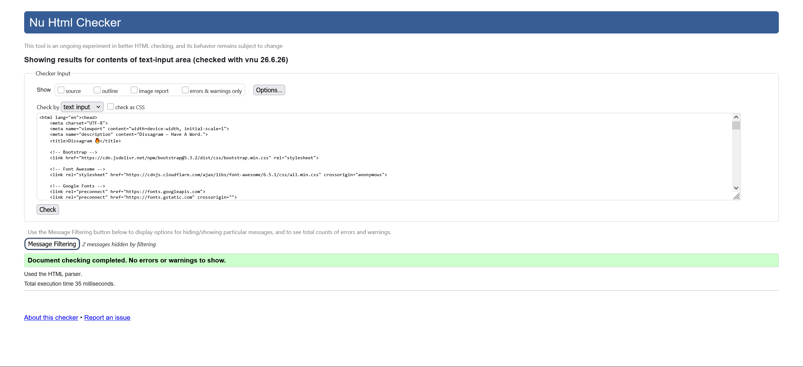</h2>

<br>

-   ### How It Works

<h2 align="right">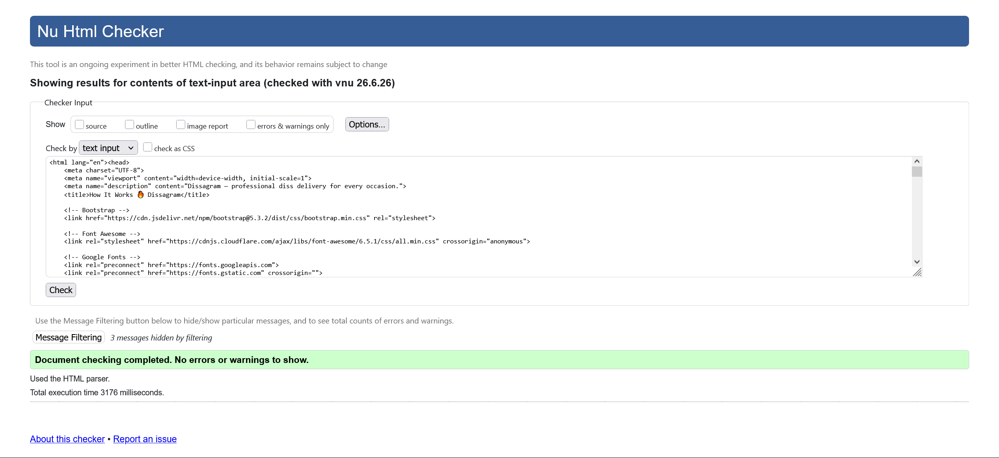</h2>

<br>

-   ### Get Your Pack

<h2 align="right">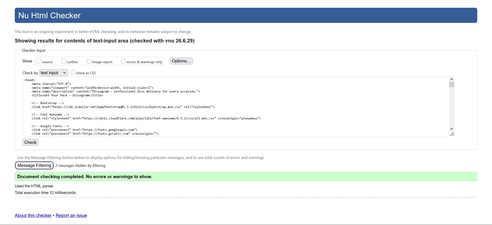</h2>

<br>

-   ### Build Your Diss

<h2 align="right">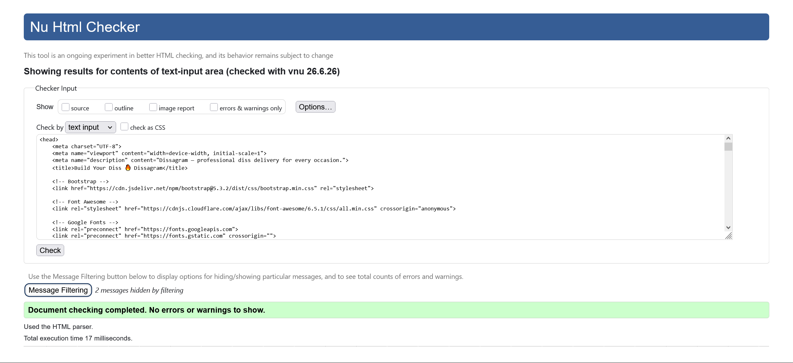</h2>

<br>

-   ### My Disses

<h2 align="right">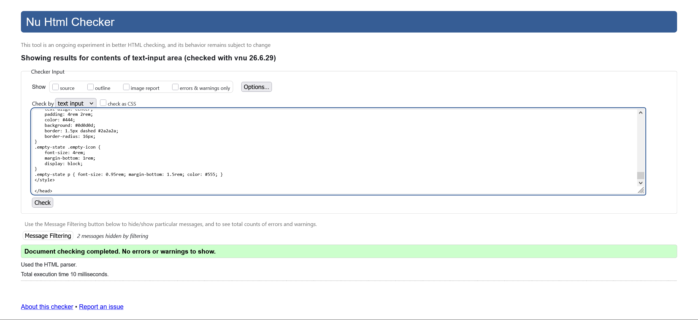</h2>

<br>

-   ### Roast Feed

<h2 align="right">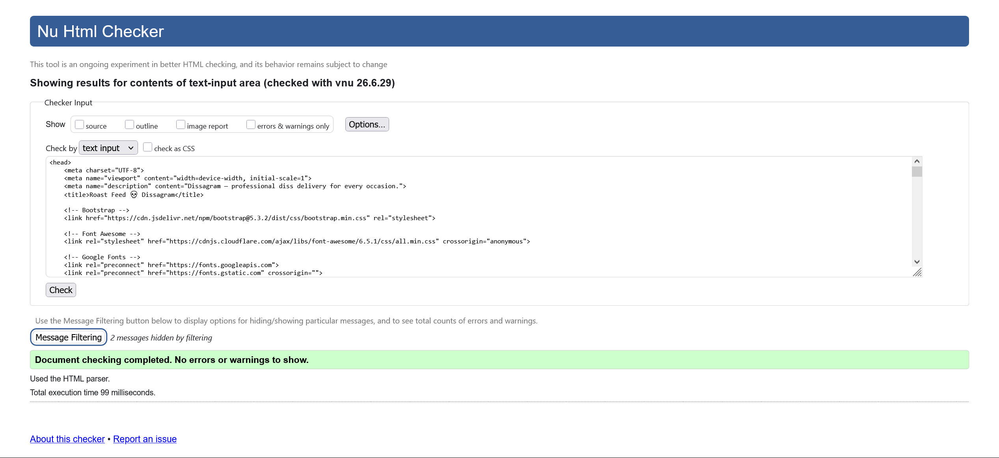</h2>

<br>

-   ### Contact

<h2 align="right">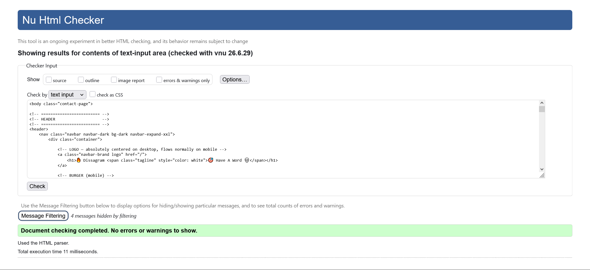</h2>

<br>

## W3C CSS Validator

<h2 align="center">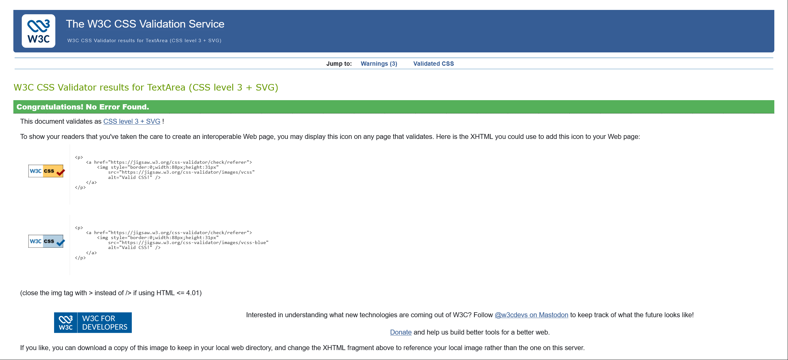</h2>

<br>
<br>

## JSHint JavaScript Validator

The diss builder's carousel and step-reveal logic (the most substantial JavaScript on the site) was validated using [JSHint](https://jshint.com/), with only an unused variable warning (for future features) and no errors reported.

<h2 align="center">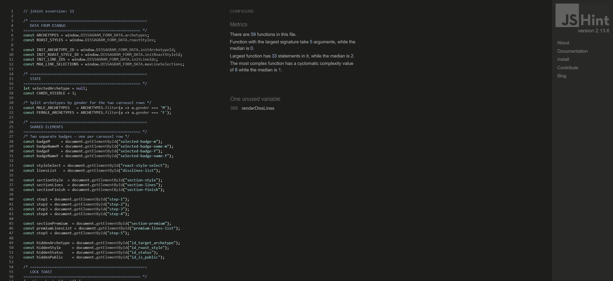</h2>

<br>
<br>

## PEP8 / Python Validation

All Python code was checked for [PEP8](https://peps.python.org/pep-0008/) compliance using the [CI Python Linter](https://pep8ci.herokuapp.com/).

-   ### Disses Models

<h2 align="right">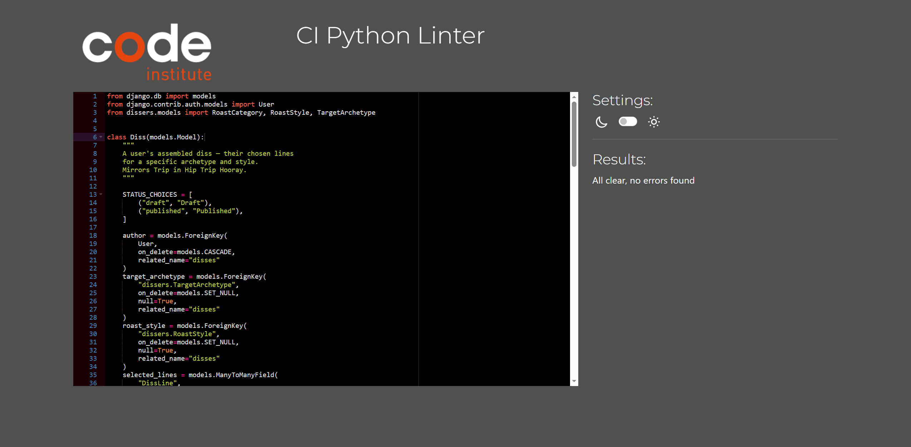</h2>

<br>

-   ### Roasts Models

<h2 align="right">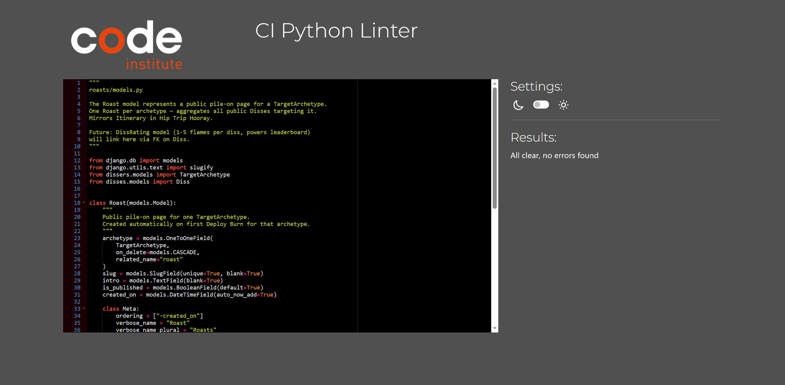</h2>

<br>

-   ### Roasts Views

<h2 align="right">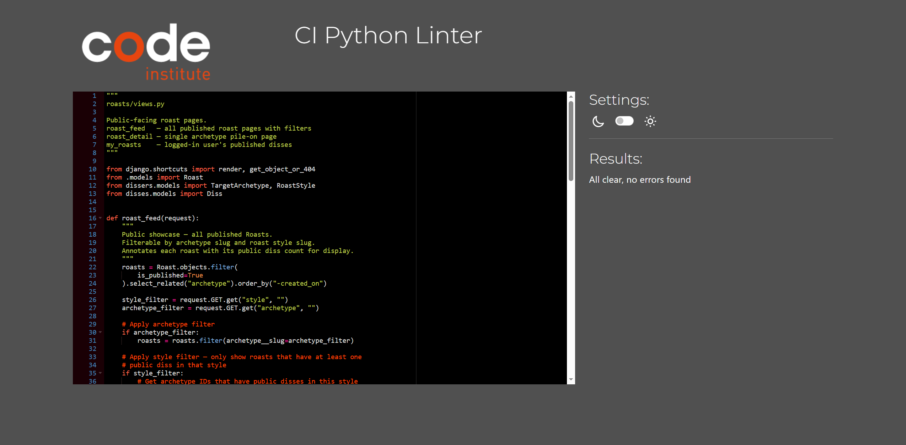</h2>

<br>

-   ### Orders Models

<h2 align="right">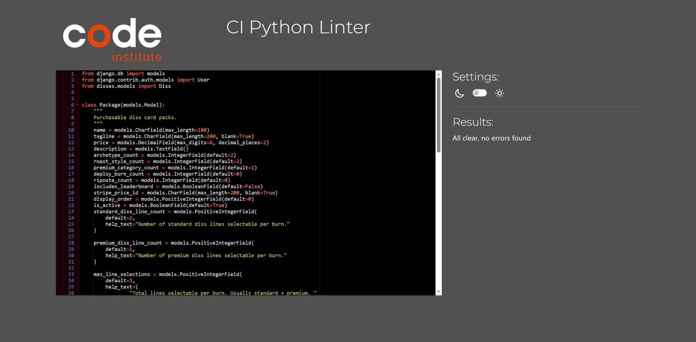</h2>

<br>

-   ### Orders Views

<h2 align="right">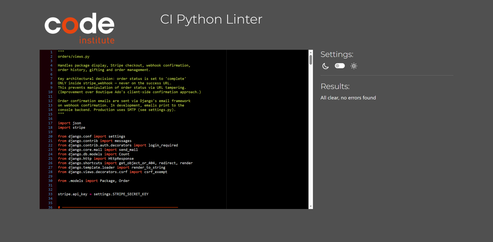</h2>

<br>


<br>
<br>

## Lighthouse

[Google Lighthouse](https://developer.chrome.com/docs/lighthouse/overview/) reports were used to examine key pages for Performance, Accessibility, Best Practices and SEO.

### Homepage

<h3 align="center">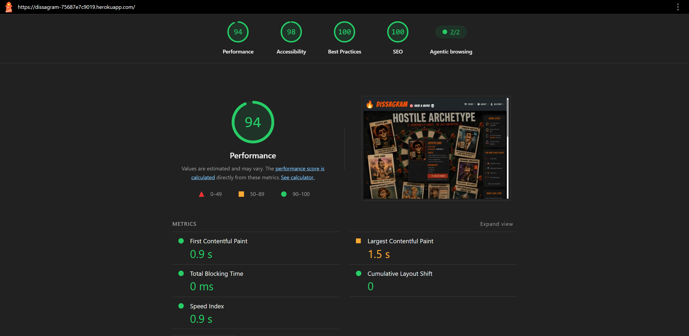</h3>

### How It Works

<h3 align="center">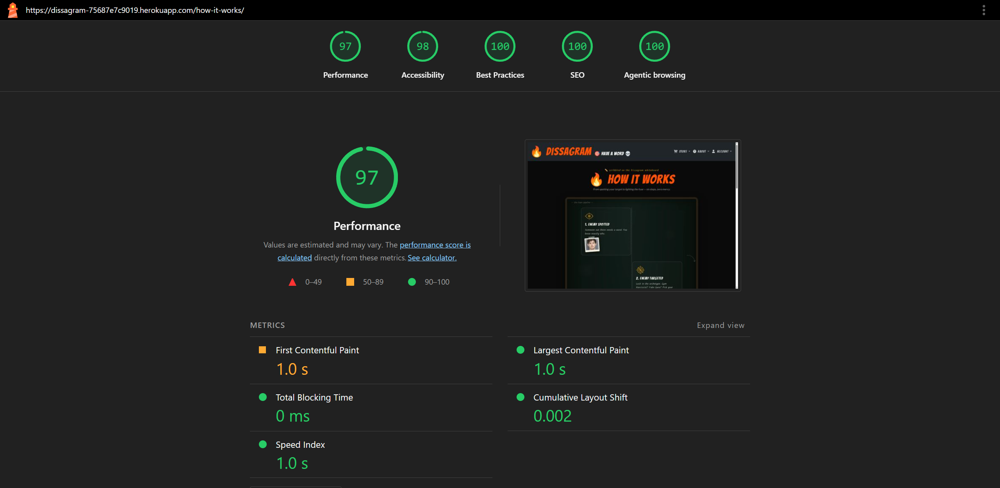</h3>

### My Disses

<h3 align="center">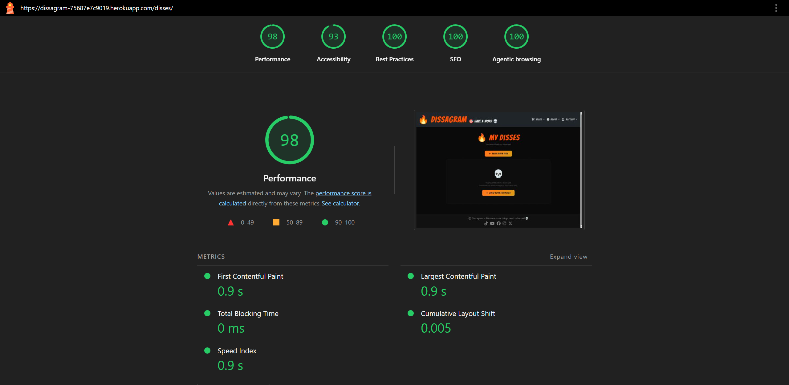</h3>

### Login

<h3 align="center">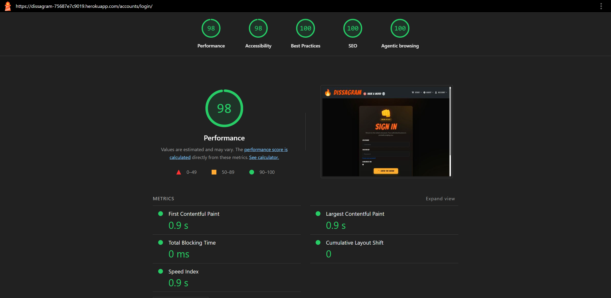</h3>

### Roast Feed

<h3 align="center">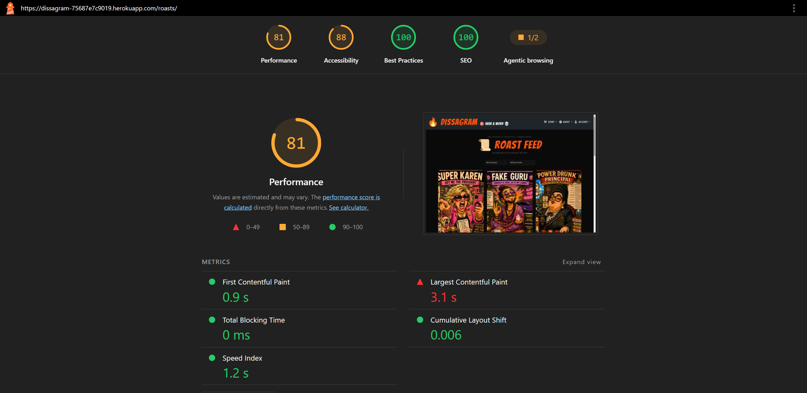</h3>

-   The Roast Feed will be improved in dissagram v2.0 by compressing all backend images uploaded through the admin panel. Owing to time constraints, this was not possible for the current iteration.

<br>
<br>

## Responsiveness

Dissagram was tested across the following breakpoints using Chrome DevTools device emulation and physical devices:

- ### iPhone

<h3 align="center"></h3>

- ### iPad

<h3 align="center"></h3>

- ### Laptop (1366×768)

<h3 align="center"></h3>

- ### FHD (1920×1080)

<h3 align="center"></h3>

<br>
<br>

## Debugging

### Resolved

## Debugging

### Resolved

The following bugs were identified and fixed during development:

---

#### 1. Stripe CLI not found in Git Bash

| | |
|---|---|
| **Symptom** | `bash: stripe: command not found` when running `stripe listen` |
| **Cause** | Git Bash on Windows does not inherit the Windows system PATH where the Stripe CLI is installed, so it cannot locate the `stripe` executable |
| **Fix** | Switched to PowerShell and ran the PATH refresh command before calling the CLI: `$env:Path = [System.Environment]::GetEnvironmentVariable("Path","Machine") + ";" + [System.Environment]::GetEnvironmentVariable("Path","User")` |

---

#### 2. Stripe CLI authentication expired mid-project

| | |
|---|---|
| **Symptom** | `FATAL Error while authenticating with Stripe: Post "https://api.stripe.com/v1/stripecli/sessions": context canceled` |
| **Cause** | The Stripe CLI authentication token expires after 90 days; the pairing code had expired since the previous session |
| **Fix** | Re-authenticated by running `stripe login` in PowerShell, which opened a browser confirmation page. Confirmed that the listener (`stripe listen --forward-to localhost:8000/orders/webhook/`) should always be started in a **separate terminal** before making any test purchases |

---

#### 3. `requirements.txt` saved as UTF-16, breaking Heroku deployment

| | |
|---|---|
| **Symptom** | `pip install -r requirements.txt` would fail on Heroku — the file appeared corrupt |
| **Cause** | Generated on Windows using PowerShell's `>` redirect operator (`pip freeze > requirements.txt`), which defaults to UTF-16LE with BOM encoding rather than UTF-8. Pip requires plain UTF-8/ASCII |
| **Fix** | Re-saved using `iconv -f utf-16 -t utf-8 requirements.txt > requirements_fixed.txt`. In future: use `pip freeze \| Out-File -Encoding utf8 requirements.txt` in PowerShell, or check VS Code's bottom-right status bar for the file's encoding before committing |

---

#### 4. Orders page showed "No orders yet" immediately after a successful test payment

| | |
|---|---|
| **Symptom** | User completed a test Stripe payment and reached the "Pack Unlocked" page, but the My Orders page showed no orders |
| **Cause** | The Stripe CLI webhook listener was not running (or not authenticated) during the test purchase, so the `checkout.session.completed` event never reached the Django webhook endpoint — and since Dissagram creates orders **only** inside the webhook handler, no `Order` record was ever created |
| **Fix** | Re-authenticated the Stripe CLI (`stripe login`) and confirmed the listener was running in a separate terminal **before** starting the test. Documented the correct three-terminal workflow: (1) Django `runserver`, (2) Stripe listener, (3) browser testing |

---

#### 5. Stripe webhook returning `500` on `checkout.session.completed`

| | |
|---|---|
| **Symptom** | Stripe CLI output showed `<-- [500] POST http://localhost:8000/orders/webhook/` on the `checkout.session.completed` event, while other events returned 200 |
| **Cause** | An unhandled exception inside the order-creation block was crashing the webhook view before a response could be returned. The exception intermittently surfaced when the email-sending code also encountered an error, and neither was wrapped safely |
| **Fix** | Separated the order creation and email sending into distinct `try/except` blocks. Email failure is now completely isolated — it can never crash the webhook or prevent the order from being created. The outer block logs the error and returns `500` only if the order itself cannot be created |

---

#### 6. Order confirmation email "not arriving"

| | |
|---|---|
| **Symptom** | After a successful test purchase, no confirmation email arrived in the inbox |
| **Cause** | In development, Django was correctly using the `console.EmailBackend`, which **prints emails to the terminal** rather than sending them to a real inbox. This was mistaken for the feature not working |
| **Fix** | Confirmed expected behaviour — the email output was visible in the Django `runserver` terminal. Documented the `DEBUG`-controlled backend switch: `console.EmailBackend` in development, SMTP in production |

---

#### 7. Gift a Pack section not appearing on the Packages page

| | |
|---|---|
| **Symptom** | The Gift a Pack form was invisible even for logged-in users who owned a pack |
| **Cause** | The template condition was ``, but the `package_list` view was not correctly computing or passing `user_owned_packages` in all cases |
| **Fix** | Changed the template condition to `` so the gift form is shown to any logged-in user — which is the correct behaviour, since gifting doesn't require the sender to already own the pack they're gifting |

---

#### 8. Coming Soon Roast Pack card not displaying in the pack grid

| | |
|---|---|
| **Symptom** | The Coming Soon card was either invisible or floating outside the grid with no border styling |
| **Cause** | The HTML for the Coming Soon card was placed **outside** the closing `</div>` of `.pack-grid`, so it was not part of the CSS grid layout. It also lacked the `.pack-coming-soon` CSS class and the required styles |
| **Fix** | Moved the Coming Soon card inside `.pack-grid` (before the closing `</div>`), added the correct `.pack-coming-soon` class, and added CSS for the dashed border, greyed-out opacity (`0.45`), `grayscale(0.5)` filter and `cursor: not-allowed` to clearly signal it is not yet purchasable |

---

#### 9. Django messages rendering twice on some pages

| | |
|---|---|
| **Symptom** | Notifications appeared as both a Bootstrap alert banner at the top of the page **and** as an animated toast in the bottom-right corner simultaneously |
| **Cause** | `base.html` contained two separate message-rendering blocks: the original Bootstrap `alert-dismissible` loop (from the initial project setup) and the new custom toast block added later |
| **Fix** | Removed the old Bootstrap alert block entirely, leaving only the custom toast system. All Django `messages` framework output now routes exclusively through the toast notification system |

---

#### 10. Both archetype carousels stopped rendering entirely

| | |
|---|---|
| **Symptom** | After adding the premium diss lines section to `diss_form.html`, both the male and female archetype carousels became completely blank. No JavaScript errors were shown in the browser console |
| **Cause** | The `querySelectorAll()` calls inside `enforceDissLineLimit()` used multi-line string literals (strings split across two lines using a line break inside the quotes). In JavaScript, regular quoted strings cannot contain literal newlines — this produced a silent `SyntaxError` that halted the **entire script** before the carousel `build()` functions could run |
| **Fix** | Collapsed both selector strings onto a single line each: `document.querySelectorAll("#disslines-list input[name='selected_lines'], #premium-lines-list input[name='selected_lines']")` |

---

#### 11. Premium diss categories never appeared in the diss builder

| | |
|---|---|
| **Symptom** | Users who had purchased a pack with premium category access (e.g. LinkedIn Endorsement) never saw Step 4 — the premium diss lines section — even after buying a pack and returning to the diss builder |
| **Cause** | The `is_premium` flag was missing from the diss line objects in the JSON payload built by `_archetype_json`. The JavaScript split `const premiumLines = lines.filter(l => l.is_premium)` therefore always returned an empty array, so Step 4 was never revealed |
| **Fix** | Added `"is_premium": not (line.category.is_free if line.category else True)` to each diss line dictionary in `_archetype_json`, deriving the flag from the line's `RoastCategory.is_free` field |

---

#### 12. Pack level returning `0` even for users who had purchased a pack

| | |
|---|---|
| **Symptom** | After purchasing the Diss Pack, `_get_user_pack_level()` still returned `0`, meaning no premium categories were unlocked |
| **Cause** | The `_get_user_pack_level()` helper reads `package.display_order` to determine tier — `0 = free, 1 = Diss Pack, 2 = Burn Pack`. The packages in the Django admin had `display_order = 0` for both packs (the default value was never changed), so the function always returned `0` regardless of what was purchased |
| **Fix** | Updated the Package records in Django admin: Diss Pack → `display_order = 1`, Burn Pack → `display_order = 2`. Premium categories immediately became accessible after the fix |

---

#### 13. Diss Detail page listed the Premium diss category above standard diss lines

| | |
|---|---|
| **Symptom** | When viewing a saved diss, a LinkedIn Endorsement line appeared at the top of the burn list, above the standard Diss Lines — the reverse of the intended order |
| **Cause** | `diss.selected_lines.all()` used the model's default ordering. In SQLite, `NULL` values sort **before** non-null values, so premium lines (which have `roast_style = NULL`) sorted to the top |
| **Fix** | The `diss_detail` view now passes an explicitly ordered queryset: `diss.selected_lines.select_related("category").order_by("-category__is_free", "display_order")` — this puts free (standard) lines first, premium lines last, and respects `display_order` within each group |

---

#### 14. `ACCOUNT_EMAIL_VERIFICATION = 'mandatory'` blocked registration in development

| | |
|---|---|
| **Symptom** | New user registrations appeared to succeed but users were then unable to log in, as allauth required email verification before granting access |
| **Cause** | `ACCOUNT_EMAIL_VERIFICATION` was set to `'mandatory'` in settings. In development, Django uses the console email backend — so the verification email was printed to the terminal, not delivered to the user's inbox, making it impossible to complete verification through normal browser flow |
| **Fix** | Changed to `ACCOUNT_EMAIL_VERIFICATION = 'none'` — appropriate for assessment purposes and straightforward for the assessor to test. Email verification can be re-enabled for a production launch |

---

#### 15. `hero-cta-main` button on homepage had no visible styling

| | |
|---|---|
| **Symptom** | The centre "Build a Diss" / "Get a Free Diss" button on the homepage appeared as plain underlined text rather than a styled button |
| **Cause** | The `.hero-cta-main` CSS was defined in the `` of the How It Works template — a completely separate page. The homepage (`index.html`) had no `` block at all, so the styles were never loaded for that page |
| **Fix** | Added a `` block to `index.html` containing the `.hero-cta-main` and `.hero-buttons` CSS. Long-term, both classes should be moved to the global `static/css/style.css` so they're available site-wide without duplication |

---

#### 16. Edit Diss form did not restore the previously selected roast style

| | |
|---|---|
| **Symptom** | Opening "Edit Diss" on a saved diss correctly highlighted the saved archetype in the carousel, but the roast style avatar grid showed no selection — the user had to re-select their roast style before they could save |
| **Cause** | The `INIT_ROAST_STYLE_ID` restoration logic used `styleSelect.dispatchEvent(new Event("change"))`, but `styleSelect` was a hidden input — not the avatar grid card. The avatar card click handler (which sets the visual selected state) was never triggered |
| **Fix** | Updated the init block to also find and `.click()` the matching style card in the avatar grid after a short `setTimeout`, so the visual selection state is restored alongside the hidden input value |

---

#### 17. Procfile and runtime.txt missing from project root

| | |
|---|---|
| **Symptom** | Not a runtime error, but a pre-deployment gap — Heroku requires a `Procfile` to know how to start the application, and `runtime.txt` to pin the Python version |
| **Cause** | Neither file had been created during development (the project was run locally via `python manage.py runserver`) |
| **Fix** | Created `Procfile` containing `web: gunicorn dissagram.wsgi` and `runtime.txt` containing `python-3.12.3` in the project root |

---

### Known Issues

| Issue | Status |
|---|---|
| Automated tests only cover `disses` and `accounts` apps — `orders`, `roasts`, `dissers` and `contact` rely on manual testing | Documented gap; comprehensive manual test coverage provided in the interim. Full automated test suite is planned post-submission |
| Comments, flame ratings and the leaderboard are not yet implemented | Deliberately deferred to post-submission V2 — the `includes_leaderboard` flag already exists on the `Package` model as a foundation. See [Future Features](#future-features) |
| Deploy Burn count limits are not yet enforced at the model level | The `deploy_burn_count` field exists on `Package` and is displayed on the packages page, with a coming soon notification, but the enforcement logic is a planned V2 addition |
| Gift a Pack currently requires the recipient to have an existing Dissagram account | A future enhancement will accept an email address and send an invitation to non-registered recipients |

| Issue | Cause | Fix |
|---|---|---|
| Both archetype carousels stopped rendering entirely | A multi-line JavaScript string literal inside `querySelectorAll()` produced a silent `SyntaxError`, halting the whole script before carousel build functions ran | Collapsed the selector strings onto single lines |
| Premium diss categories never appeared in the builder | The `is_premium` flag was missing from the JSON payload built in `_archetype_json`, so the front-end split between standard/premium lines always returned an empty premium list | Added `is_premium` to each diss line dict, derived from the line's `RoastCategory.is_free` |
| Orders page showed "No orders yet" immediately after a successful test payment | The Stripe CLI webhook listener was not running/authenticated during the test purchase, so `checkout.session.completed` never reached the Django webhook endpoint and no `Order` was created | Re-authenticated the Stripe CLI (`stripe login`) and confirmed the listener was running before testing |
| Webhook returned `500` on `checkout.session.completed` | An unhandled exception inside the order-creation block (intermittently surfaced when email sending also failed) crashed before a response was returned | Wrapped order creation and email sending in clearly separated `try/except` blocks, with email failure isolated so it can never break order creation |
| Order confirmation email "not arriving" | Emails were correctly being sent via Django's **console** email backend in development, which prints to the terminal rather than an inbox — this was mistaken for the feature not working | Confirmed expected behaviour; documented console vs SMTP backend switch via `DEBUG` |
| Diss Detail page listed the Premium diss category above standard diss lines | `selected_lines.all()` used the model's default ordering, and `NULL` (premium lines have no `roast_style`) sorts before populated values in SQLite | View now explicitly orders lines by `-category__is_free` before display order |
| `requirements.txt` saved as UTF-16 | Generated via Windows PowerShell's `>` redirect, which defaults to UTF-16LE with BOM rather than UTF-8 | Re-saved as UTF-8; `pip install -r requirements.txt` confirmed working |

### Known Issues

| Issue | Status |
|---|---|
| `orders`, `roasts`, `dissers` and `contact` apps currently rely on manual rather than automated testing | Documented as a future improvement; manual test coverage is comprehensive for these areas in the interim |
| Comments, ratings and the leaderboard are not yet implemented | Deliberately deferred to a post-submission V2 — see [Future Features](#future-features) |

<br>
<br>

# Deployment

## Heroku

Dissagram is deployed to [Heroku](https://www.heroku.com/), with a [Neon](https://neon.tech/) PostgreSQL database in production and [Cloudinary](https://cloudinary.com/) for media storage.

### Prerequisites

- A [Heroku](https://www.heroku.com/) account
- A [Neon](https://neon.tech/) PostgreSQL database
- A [Cloudinary](https://cloudinary.com/) account
- A [Stripe](https://stripe.com/) account (test mode keys are sufficient for assessment)

### Steps

1.  **Create the Heroku app**

    - Log in to Heroku and click **New → Create new app**.
    - Choose a unique app name and region.

2.  **Add a Postgres database**

    - Create a database on [Neon](https://neon.tech/) and copy its connection string.
    - This will be set as the `DATABASE_URL` config var below.

3.  **Set Config Vars**

    In the Heroku dashboard, under **Settings → Config Vars**, add the following:

    | Key | Value |
    |---|---|
    | `SECRET_KEY` | A long, random secret string |
    | `DEBUG` | `False` |
    | `ALLOWED_HOSTS` | `your-app-name.herokuapp.com` |
    | `DATABASE_URL` | Your Neon Postgres connection string |
    | `CLOUDINARY_CLOUD_NAME` | Your Cloudinary cloud name |
    | `CLOUDINARY_API_KEY` | Your Cloudinary API key |
    | `CLOUDINARY_API_SECRET` | Your Cloudinary API secret |
    | `STRIPE_PUBLIC_KEY` | Your Stripe publishable key |
    | `STRIPE_SECRET_KEY` | Your Stripe secret key |
    | `STRIPE_WEBHOOK_SECRET` | Your **production** Stripe webhook signing secret (see step 6) |
    | `EMAIL_HOST_USER` | Your sending email address |
    | `EMAIL_HOST_PASSWORD` | Your email app password |
    | `DEFAULT_FROM_EMAIL` | The "from" address for order confirmation emails |

4.  **Connect the repository**

    - Under the **Deploy** tab, connect your GitHub repository.
    - Either enable automatic deploys from `main`, or deploy manually.

5.  **Deploy**

    - Click **Deploy Branch**.
    - Heroku will detect the `Procfile` and `runtime.txt`, install `requirements.txt`, and run the app via Gunicorn.
    - Once built, run migrations from the Heroku console:

      ```bash
      heroku run python manage.py migrate
      heroku run python manage.py createsuperuser
      ```

6.  **Configure the production Stripe webhook**

    - In the Stripe Dashboard, go to **Developers → Webhooks → Add endpoint**.
    - Set the endpoint URL to `https://your-app-name.herokuapp.com/orders/webhook/`.
    - Select the `checkout.session.completed` event.
    - Copy the generated signing secret into the `STRIPE_WEBHOOK_SECRET` config var (step 3).

7.  **Verify**

    - Visit the deployed app and confirm the homepage loads.
    - Complete a test purchase using a Stripe test card and confirm the order appears in **My Orders**.

The deployed version was tested to confirm it matches the development version in functionality.

<br>

## Forking the GitHub Repository

To fork this repository:

1. Log in to GitHub and locate the [Dissagram repository](https://github.com/yinyangsammy/dissagram).
2. At the top right of the page, click the **Fork** button.
3. You now have a copy of the repository in your own GitHub account.

<br>

## Cloning the GitHub Repository

To clone this repository:

1. Locate the [Dissagram repository](https://github.com/yinyangsammy/dissagram).
2. Click the green **Code** button, and copy the HTTPS URL.
3. In your IDE, open a terminal and run:

    ```bash
    git clone https://github.com/yinyangsammy/dissagram.git
    ```

4. Create and activate a virtual environment, then install dependencies:

    ```bash
    python -m venv venv
    venv\Scripts\activate          # Windows
    source venv/bin/activate       # macOS/Linux
    pip install -r requirements.txt
    ```

5. Create an `env.py` file in the project root (this file is git-ignored and must be created manually):

    ```python
    import os

    os.environ["SECRET_KEY"] = "your-secret-key"
    os.environ["DEBUG"] = "True"
    os.environ["DATABASE_URL"] = "sqlite:///db.sqlite3"
    os.environ["ALLOWED_HOSTS"] = "127.0.0.1,localhost"

    os.environ["STRIPE_PUBLIC_KEY"] = "your-stripe-public-key"
    os.environ["STRIPE_SECRET_KEY"] = "your-stripe-secret-key"
    os.environ["STRIPE_WEBHOOK_SECRET"] = "your-stripe-webhook-secret"

    os.environ["EMAIL_HOST_USER"] = ""
    os.environ["EMAIL_HOST_PASSWORD"] = ""
    os.environ["DEFAULT_FROM_EMAIL"] = "noreply@dissagram.com"
    ```

6. Run migrations and start the development server:

    ```bash
    python manage.py migrate
    python manage.py createsuperuser
    python manage.py runserver
    ```

7. To test Stripe payments locally, run the [Stripe CLI](https://stripe.com/docs/stripe-cli) listener in a separate terminal:

    ```bash
    stripe listen --forward-to localhost:8000/orders/webhook/
    ```

<br>
<br>

# Credits

## Code

-   [Code Institute](https://codeinstitute.net/): I referred back to tutorial videos and my other projects throughout developing dissagram.
    -   The overall project structure, Stripe integration approach, and CRUD patterns were informed by Code Institute's **Boutique Ado** walkthrough project, with deliberate, documented improvements made throughout — most notably webhook-only order confirmation (vs. client-side confirmation), a custom CSS toast notification system (vs. Bootstrap JS alerts), and a freemium content-locking layer with no Boutique Ado equivalent.

-   [Django Documentation](https://docs.djangoproject.com/): The official Django docs were referenced extensively throughout development, particularly for formsets, model relationships, authentication and deployment.

-   [django-allauth](https://django-allauth.readthedocs.io/) provided authentication, restyled with custom templates to match the Dissagram aesthetic.

-   [Stripe Documentation](https://docs.stripe.com/): Used throughout the checkout implementation.

-   [Stack Overflow](https://stackoverflow.com/): Referenced for numerous specific implementation questions throughout development.

-   [Bootstrap 5 Documentation](https://getbootstrap.com/docs/5.0/): Referenced for responsive layout, modal and component implementation.

-   [Mozilla Developer Network](https://developer.mozilla.org/): Referenced for JavaScript, CSS and HTML questions.

-   [dbdiagram.io](https://dbdiagram.io/home): ERD diagram creator

<br>

## Media

-   Colour Palette was generated by [Coolors](https://coolors.co/).

-   All images and artwork on this site were created by yinyangsammy, using his own creations alongside collaborations with different AI art generators, predominantly [ChatGPT](https://chatgpt.com/).

- Icons: [Font Awesome](https://fontawesome.com/).
- Fonts: [Google Fonts](https://fonts.google.com/) — Bangers, DM Serif Display, Lato.

## Content

- All diss lines, archetype copy, roast style personas and site copy were written by the developer.

<br>

## Acknowledgements

-   Rachel Furlong, my Academic Supervisor and Lecturer, for the great lessons, inspirational pep talks, kind guidance, helpful feedback and recommended tools.

-   Thank you to friends and family who play-tested early versions of the diss builder (and, in several cases, were the direct inspiration for an archetype).

-   Thank you to the tutors and staff at Code Institute for all their support.

-   Thank you to my fellow students for their friendly tips and guidance.

-   Thank you to the Code Institute Discord Community.

-   Thank you to the Code Institute Slack Community.

-   Thank you to the Stack Overflow community.

-   Thank you to the YouTube community.

-   Thank you to the Reddit community.

<br>
<br>

# Root

Dissagram has been created as part of the developer's portfolio, and will continue being developed with new features added in the near future.

<h4 align="center">yinyangsammy 2026</h4>

<br>
<br>

**Return to TOC at the top:**

- [Table of Contents](#table-of-contents)
